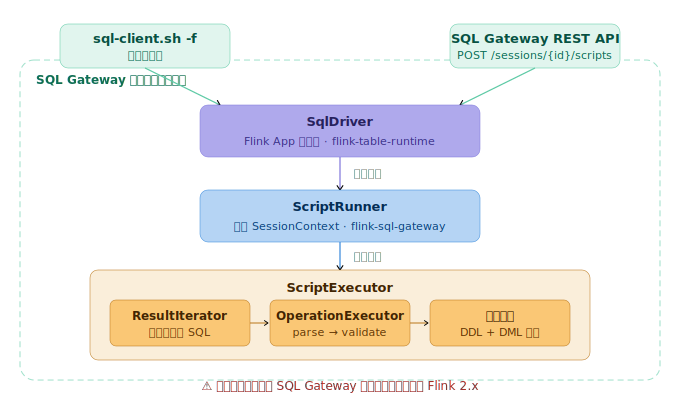
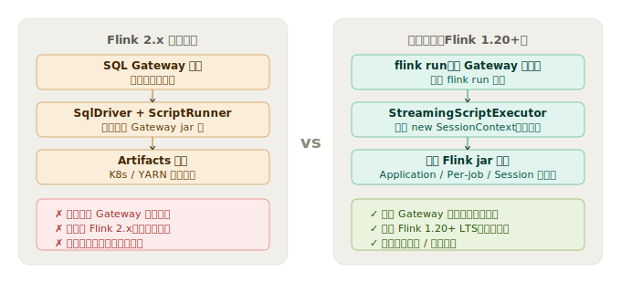
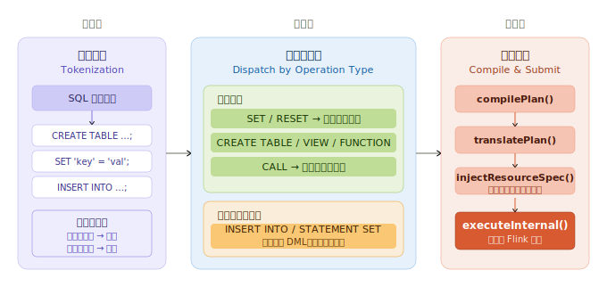

# Flink 实时数仓开发实战：像 Hive 那样用 Flink SQL

## 概览

本文介绍一种 **如何在 Flink 1.20（目前企业广泛使用的 LTS 版本）中通过 `flink run` 方式直接提交一个包含多条 SQL 的 `.sql` 文件。** 给用户提供一种类似于 `hive -f my_etl.sql` 那样丝滑的 Flink SQL 开发体验。

本方案能够运行在任何资源环境（Local、YARN、Kubernetes）、任何部署模式（Standalone、Session、Application）下。甚至可以同时支持 Flink 1.20.x 和 Flink 2.x。作者基于之前的大厂经历分享一下大厂内部实时平台的内部实践及核心原理，希望能给大家提供一种新的思路。

## 我们怀念的 Hive 开发模式

用过 Hive 的人大概都记得那种“一行命令搞定一切”的感觉：

```bash
hive -f my_etl.sql
```

一条 `.sql` 文件里，`CREATE TABLE`、`SET` 参数、`INSERT INTO` 全写在一起，写完直接执行。这份脚本就是你的"作业"，可以进 Git、可以 Code Review、可以版本管理。**SQL Script 文件化也是后面离线数仓规范管理最基本的前提**。

## Flink 社区

### Flink 1.20 开发方式

**方式一：SQL Client 交互模式**

启动 SQL Client，逐条输入 SQL：

```bash
$FLINK_HOME/bin/sql-client.sh
Flink SQL> CREATE TABLE ods_orders (...);
Flink SQL> CREATE TABLE dwd_orders (...);
Flink SQL> INSERT INTO dwd_orders SELECT ... FROM ods_orders ...;
```

这是大多数人入门的方式，适合探索和调试。但每次启动都要重新建表，DDL 和 DML 完全割裂，无法自动化。

**方式二：SQL Client 的 `-f` 模式**

SQL Client 也支持用 `-f` 指定一个 SQL 文件来执行：

```bash
$FLINK_HOME/bin/sql-client.sh -f my_etl.sql
```

这看起来已经很接近 Hive 了，问题在于：**SQL Client 的 `-f` 只支持 Standalone 模式或 Session 模式**。但是 Session 集群通常不用于线上大规模的实时计算，因为它资源是共享的，会发生抢占。生产环境需要 Per-job Mode 或 Application Mode，但 `-f` 模式不支持这两种部署模式。

**方式三：`flink run` 提交单个 SQL**

这是我们最熟悉的方式（`DataStream` 的提交方式）。但 Flink 原生只接受**单条 SQL 语句**（通过 `TableEnvironment#executeSql()`）：

```java
// 用户必须写 Java 代码包装 SQL
TableEnvironment tEnv = TableEnvironment.create(env);
tEnv.executeSql("CREATE TABLE ods_orders (...)");
tEnv.executeSql("INSERT INTO dwd_orders SELECT ...");
```

这意味着如果你想在 Application/Pre-job Mode 下跑 Flink SQL，要么写 Java 代码包装每条 SQL，要么忍受 Session 模式的各种限制。想把 DDL 和业务逻辑放在一个 `.sql` 文件里一条命令跑完？对不起，原生不支持。

### Flink 社区的探索：FLIP-316/480

社区也意识到了不能在 Application Mode 下提交 SQL 脚本的痛点。[FLIP-316](https://cwiki.apache.org/confluence/display/FLINK/FLIP-316%3A+Support+application+mode+for+SQL+Gateway) 和 [FLIP-480](https://cwiki.apache.org/confluence/display/FLINK/FLIP-480%3A+Support+to+deploy+SQL+script+in+application+mode) 是社区在这个方向上的两代方案。

* FLIP-316（未实现）：由 SQL Gateway 生成 JSON Plan，再由 JobManager 端的 `SqlDriver` 负责执行。该方案自 2024 年 10 月提出后一直没有实质推进，**至今仍处于搁置状态**
* FLIP-480（已实现，Flink 2.x）：换了一个思路——不预编译，而是**把编译推迟到 JobManager 端**。

```
用户 SQL 脚本 → SQL Gateway（接收请求，拉起 JM）
                      ↓
              SqlDriver（JM 启动类，位于 flink-table-runtime）
                      ↓
              反射调用 ScriptRunner（位于 flink-table-sql-gateway）
                      ↓
              ScriptRunner 构建 SessionContext，委托 ScriptExecutor 逐条执行
```

但 FLIP-480 同样没有解决根本问题：**你仍然需要起一个 SQL Gateway 服务**。更难受的是：该能力**仅在 Flink 2.x 版本才开始支持**，Flink 2.x 版本和 Flink 1.x 版本有非常大的变化，带来了多项**不向前兼容**的重构，目前业界普遍还处于观望状态，并没有盲目升级。社区也考虑到了这些，因此将 Flink 1.20.x 版本作为 LTS 版本提供长期支持。

## 像 Hive 一样使用 `.sql` 文件

下面将以开源实现 [flink-sql-bootstrap](https://github.com/tonyabasy/flink-sql-bootstrap) 为例讲解使用方式、最佳实践、原理剖析、自建指南。你可以参考其源码自建，也可以直接使用。

先看最终效果，一个 `flink run` 命令跑起完整的 Word Count：

```bash
$FLINK_HOME/bin/flink run \
    --target local \
    /path/to/flink-sql-bootstrap.jar \
    --script-file classpath:example-word-count.sql
```

`flink-sql-boostrap.jar` 是一个 Flink Application，有一个包含 Main 方法的类。`--script-file` 是传入 SQL file 的方式，支持多种协议：

* **HTTP/HTTPS**：通常用于某个后端服务集成或 Git 服务器，例如：https://my-script-file-server/example-word-count.sql
* **HDFS/S3**：通常用于传统的大数据环境，例如：hdfs://flink/scripts/example-word-count.sql
* **Local**：通常用于本地测试或在服务器中脚本发布，例如：file:///Users/flink/scripts/example-word-count.sql
* **Classpath**：仅限于 `flink-sql-bootstrap.jar` 中的示例，例如：classpath:example-word-count.sql

*注：其他参数及更多使用方式可以通过 `--help` 查阅，也可以项目的 [README](https://github.com/tonyabasy/flink-sql-bootstrap/blob/main/README_CN.md)。*

而这条 `example-word-count.sql` 里，DDL 和 DML 同框出镜：

```sql
-- 源表：datagen 自动生成句子
CREATE TEMPORARY TABLE source_table (
  sentence STRING
) WITH (
  'connector' = 'datagen',
  'rows-per-second' = '1'
);

-- 目标表：print 输出到控制台
CREATE TEMPORARY TABLE sink_table (
  word STRING,
  cnt BIGINT
) WITH (
  'connector' = 'print'
);

-- 一句 INSERT 搞定分词 + 分组计数
INSERT INTO sink_table
SELECT word, COUNT(*) AS cnt
FROM source_table
CROSS JOIN UNNEST(SPLIT(sentence, ' ')) AS t(word)
GROUP BY word;
```

执行后控制台立刻输出：

```
+I[hello, 1]
+I[world, 2]
+I[flink, 1]
...
```

就这么简单。DDL 建表、DML 查数据，一条脚本、一个 `flink run` 命令全搞定。

## 最佳实践：SQL 脚本的工程化建议

结合我们在实际项目中的经验，分享几个 SQL 脚本组织的最佳实践：

### 1. 目录结构

```
warehouse-example/
├── data/                           # ODS 层测试数据
│   └── ods_orders.csv
├── lib/                            # 依赖 jar
│   └── flink-sql-bootstrap-1.0.0.jar
├── scripts/                        # 辅助脚本（如测试数据生成）
│   └── generate_orders_test_data.py
├── result/                         # SQL 脚本产出目录
│   ├── dwd_orders/dt=yyyyMMdd/
│   └── ads_user_amount/dt=yyyyMMdd/
└── warehouse/                      # SQL 业务逻辑脚本
    └── orders/
        ├── dwd_orders_di.sql       # DWD 层：清洗 + 维度补充
        └── ads_user_amount_di.sql  # ADS 层：用户聚合统计
```

> 每个示例都是一个自包含的目录，顶层按场景命名（如 `warehouse-example`），内部统一按 data/、lib/、scripts/、result/、warehouse/ 组织。

小项目可以直接用单体脚本（DDL+DML 在一个文件），大项目按层拆分 DDL 和 DML。

完整的最佳实践示例工程见 [flink-sql-bootstrap-examples](https://github.com/tonyabasy/flink-sql-bootstrap-examples) 仓库。

### 2. 注释即文档

SQL 脚本应该像代码仓库一样，包含清晰的注释：

- 文件头注释：说明作业用途、上下游依赖、告警联系人
- 表级注释：说明每张表的业务含义
- 关键逻辑注释：窗口定义、复杂 JOIN 条件、UDF 使用说明

### 3. 参数外置

环境相关的参数（Kafka 地址、数据库连接、Checkpoint 间隔）建议用 `SET` 声明在 SQL 脚本中，而不是散落在 `flink-conf.yaml` 里。这样脚本自包含，部署到新环境时一目了然。

### 4. 善用干运行模式做语法检查

在 CI 或提交前，用干运行（dry-run）模式快速校验 SQL 语法，无需连接集群。

```bash
flink run path/to/flink-sql-bootstrap.jar --script-file jobs/etl_orders.sql --validate
```

这会解析所有语句，逐条校验语法，错误信息精确到行号和列号。自建实现时，可以在提交前先调 `parser.parse(sql)` 逐条检查每个 `Operation` 是否合法。

## 原理：SQL 脚本如何被"拆解-执行-编译"？
### 剥开来看：Flink 2.x 到底怎么做到的

把 Flink 2.x 源码打开看，SQL 脚本在 Application Mode 下的完整执行链路如下：

<p align="center"></p>
<p align="center"><em>图 1 · Flink 2.x SQL 脚本 Application Mode 完整执行链路</em></p>

关键角色：
- **`SqlDriver`**：部署在 `flink-table-runtime`，作为 Flink App Main 启动类，反向反射加载 `$FLINK_HOME/opt/flink-sql-gateaway-*.jar` 中的类 `ScriptRunner`
- **`ScriptRunner`**：部署在 `flink-sql-gateway` 模块，负责构建 `SessionContext` 运行环境
- **`ScriptExecutor`**：核心执行器，内置的 `ResultIterator` 通过状态机的方式切分 SQL，然后委托 `OperationExecutor` 逐条解析执行

## 解决思路：跟随社区路线，把 Flink 2.x 的能力下放到 1.x

如果熟悉 Flink SQL Gateway 的架构演进过程不难发现：

**Flink SQL Gateway 自 1.16 引入以来，其核心链路 `SessionContext → OperationExecutor → Planner` 一直是所有 Flink SQL 解析、验证、编译、执行的基石。** 单条 SQL 语句的 `parse → validate → compile → execute` 路径在 1.x 到 2.x 中保持了高度稳定，变化主要集中在接口入参和部署模式支持上。

这意味着：**不需要修改 SQL 执行逻辑，只需要做少量兼容工作就能把 Flink 2.x 的 SQL 文件执行能力带到 1.20。**

### 两条路的对比：官方方案 vs 本文方案

<p align="center"></p>
<p align="center"><em>图 2 · 官方方案（Flink 2.x）与本文方案（Flink 1.20+）核心差异</em></p>

具体来说，我们的思路和社区路线保持一致：

- **复用 Flink 2.2.0 中 `ScriptExecutor` 的 Multi-StatementSQL 切分逻辑**（逐字符扫描、状态机处理引号和注释、分号断句）
- **去掉 Gateway 服务依赖**：只把 `flink-sql-gateway` 作为 jar 库引入 classpath，不启动 Gateway 进程。`SessionContext`、`OperationExecutor` 等跟随 Flink Application 在任务启动时构建
- **唯一的调整**：原版 `ScriptExecutor` 是切一条执行一条，我们将 DML（`INSERT INTO` / `STATEMENT SET`）推迟到最后统一编译。这不仅让脚本的执行顺序更加可控，还为后续的 Flink SQL 细粒度资源配置和 Flink SQL CI/CD 集成预留了空间（后续文章会详谈，敬请期待）

> 关于 Flink SQL 细粒度资源配置和 Flink SQL CI/CD：两者是企业生产级的大杀器。
> - CI/CD：让 SQL 作业纳入和业务代码同等的工程治理体系——版本管理、Code Review、自动化验证（SQL语法验证、表引用、字段引用验证）
> - 细粒度资源配置：让 Flink SQL Job 的资源配置同 DataStream 细粒度资源配置那样灵活，大大节省线上资源

Flink 原生不接受 Multi-Statement SQL，所以必须自己实现脚本切分与编排。**切分器直接复用了 Flink 2.2.0 中 `ScriptExecutor` 的状态机逻辑**（逐字符扫描、正确处理单/双/反引号内的分号和注释内的分号），DDL/DML 的分派则通过解析 `Operation` 对象的类型来决定。核心引擎 `StreamingScriptExecutor` 的工作流分为三个阶段。

<p align="center"></p>
<p align="center"><em>图3 · 三阶段处理 Multi-Statement SQL</em></p>

### 阶段一：智能切分（Tokenization）

`StreamingScriptExecutor` 内置了一个状态机驱动的 SQL 切分器 `ResultIterator`，逐字符扫描脚本内容：

- **单引号 `'...'`、双引号 `"..."`、反引号 `` `...` `` 内的分号视为字面量**，不切分
- **单行注释 `--` 和多行注释 `/* */` 内的分号跳过**
- **只将顶层（非引号、非注释）的分号识别为语句边界**

这意味着你可以在字符串里写 `';'`，在注释里写 `-- use ';' to split`，都不会导致错误的切分。

### 阶段二：按类型分派（Dispatch）

切分后的每条语句被解析为 Flink 的 `Operation` 对象，然后按类型判断执行策略：

| 语句类型 | 策略 | 原因 |
|---------|------|------|
| `SET` / `RESET` | **立即执行** | 影响后续语句的编译环境 |
| `CREATE TABLE` / `CREATE VIEW` / `CREATE FUNCTION`（DDL） | **立即执行** | 后续 DML 语句可能引用这些 Catalog 对象 |
| `CALL` | **立即执行** | 存储过程的副作用需要立即生效 |
| `INSERT INTO` / `STATEMENT SET`（DML） | **延迟到统一编译** | 这是真正要提交的 Flink Job，需要先完成翻译再注入资源 |

这就是核心设计哲学：**DDL 立即执行，DML 延迟批量编译**。DDL 必须先落地到内存 Catalog，后续的 DML 解析才能引用这些表；而 DML 推迟到所有 DDL 执行完毕后再统一编译，这样可以拿到一个完整的 Transformation DAG，为后续 DML（`INSERT INTO ...`）的解析、验证、编译提供必要的上下文。

### 阶段三：统一提交

所有 DDL 执行完毕、所有 DML 收集完成后，`StreamingScriptExecutor` 调用 Flink Table Planner（`flink-table-planner` jar 中的编译优化器）的标准接口：`compilePlan()` 将 SQL 编译为逻辑执行计划、`translatePlan()` 将其翻译为 `Transformation` DAG，然后（可选）注入算子级资源配置，最终通过 `executeInternal()` 提交到集群。

整个流程可以概括为：

```
SQL 脚本 → 切分 → [DDL: 立即执行] → 收集 DML → compilePlan → translatePlan
                                                        ↓
                                               injectResourceSpec
                                                        ↓
                                               executeInternal → Flink 集群
```

## 自建指南（如果你不想直接用开源版）

理解了原理后，如果你想自己实现同样的能力，需要处理下面三个环节。`flink-sql-bootstrap` 中的对应源码可作为参考。

### 1. 依赖管理：为什么必须靠 `flink-sql-gateway`

Flink SQL Gateway 自 **1.16** 引入以来，一直是所有 Flink SQL 解析、验证、编译和执行的标准入口。要自建 Multi-Statement 执行能力，关键依赖是：

| Maven 依赖 | 核心能力 |
|-----------|---------|
| `org.apache.flink:flink-sql-gateway` | `SessionContext`, `OperationExecutor`, `SessionEnvironment` |
| `org.apache.flink:flink-table-runtime` | `Planner`, `TableEnvironmentImpl` |
| `org.apache.flink:flink-table-planner` | 编译和优化 |

**为什么不能绕过这套体系？** 这几个类的作用分别是：
- `SessionContext`（会话管理）：管理 UDF 类加载器、Catalog 注册和 Session 级别配置
- `OperationExecutor`（SQL 操作执行）：封装了 `parse → validate → compile` 的标准流水线
- `Planner`（SQL 编译优化）：将 `Operation` 编译为可执行的 Flink Job

这三者共同构成了 Flink SQL 语义兼容性的保证。自己重建一套不仅工作量巨大，还可能和社区后续的 SQL 语法演进脱节。

幸运的是，这套依赖不需要启动 Gateway 服务进程——它们只是 `flink-sql-gateway-*.jar` 包中的类，在代码中直接 `new` 即可。

### 2. Flink 1.20.x 兼容性修补

虽然核心链路（单条 SQL 的 `parse → validate → compile → execute`）在 1.x 和 2.x 之间保持了稳定，但接口层面还是有一些不兼容的变更。以 Flink 1.20.x 为例，需要处理以下几个问题：

**① `SessionContext` 中的 URI → URL 转换 Bug（[FLINK-39687](https://issues.apache.org/jira/browse/FLINK-39687)）**

Flink 2.2.0 的 `SessionContext.create()` 在构建 `userClassLoader` 时，会直接把 `List<URI>` 强转为 `URL[]`，导致依赖列表非空时抛出 `ArrayStoreException`。修复方式：自建 `UriSafeSessionContext` 继承 `SessionContext`，逐个将 URI 转为 URL：

```java
// 修复：将每个 URI 逐个转为 URL
URL[] urls = dependencies.stream()
    .map(URI::toURL)
    .toArray(URL[]::new);
```

> 参考：[`UriSafeSessionContext.java`](https://github.com/tonyabasy/flink-sql-bootstrap/blob/main/src/main/java/com/lanting/flink/sql/bootstrap/flink/UriSafeSessionContext.java)

**② `ApplicationOperationExecutor` —— Application Mode 的执行器适配**

`ApplicationOperationExecutor` 是 `OperationExecutor` 在 Application Mode 下的子类，负责在 Application Mode 场景中管理 `TableEnvironment` 的生命周期（因为 Application Mode 下 Flink 环境由框架创建，不能自己 `new`）。

Flink 通过 Java SPI（`ServiceLoader`）机制自动发现当前模式对应的 `ExecutorFactory`：

在 Flink 1.20 中，`EmbeddedExecutorFactory.isCompatibleWith()` 有缺陷导致 Application Mode 下无法匹配。解决办法：**自建 `ApplicationOperationExecutor`**。关键在于 `getTableEnvironment()` 中使用 `StreamExecutionEnvironment.getExecutionEnvironment()`——这个静态方法直接返回 Flink 框架当前创建的 `StreamExecutionEnvironment` 实例（不管是哪个模式），从而绕开了 Factory 匹配问题。

> 参考：[`ApplicationOperationExecutor.java`](https://github.com/tonyabasy/flink-sql-bootstrap/blob/main/src/main/java/com/lanting/flink/sql/bootstrap/flink/ApplicationOperationExecutor.java)

**③ 执行结果打印适配**

Flink 2.x 在 `ResultFetcher` 中新增了 `getPrintStyle()` 方法，1.20 中不存在。自建 `Printer`，直接从 `ResolvedSchema` 构建 `TableauStyle` 来格式化输出。

> 参考：[`Printer.java`](https://github.com/tonyabasy/flink-sql-bootstrap/blob/main/src/main/java/com/lanting/flink/sql/bootstrap/executor/Printer.java)

### 3. 构建提交流程

依赖和兼容性处理完毕后，提交流程的核心骨架如下。代码中标注了哪些是 Flink 自带的类、哪些需要自建：

```java
DefaultContext defaultContext = new DefaultContext(configuration);
SessionEnvironment ssEnv = SessionEnvironment.newBuilder()
    .setSessionEndpointVersion(SqlGatewayRestAPIVersion.getDefaultVersion())
    .build();

// UriSafeSessionContext: 修复 FLINK-39687 URI→URL 转换问题（自建）
SessionContext sessionContext = UriSafeSessionContext.create(
    defaultContext, dependencies, sessionHandle, ssEnv, executor);

// StreamingScriptExecutor: SQL 切分 + DDL/DML 分派 + 资源注入（自建）
StreamingScriptExecutor executor = new StreamingScriptExecutor(
    sessionContext, sqlScript, resourceConfig, printer);

// 选择执行模式
executor.validate(script);    // 仅校验语法
executor.compile(script);     // 校验 + 编译（不提交执行）
executor.execute();           // 完整执行（切分→DDL立即→DML编译→注入资源→提交）
```

> 参考：[`SqlEntryPoint.java`](https://github.com/tonyabasy/flink-sql-bootstrap/blob/main/src/main/java/com/lanting/flink/sql/bootstrap/SqlEntryPoint.java)

## 小结

本文核心主张很简单：**`flink-sql-gateway` 的 jar 包作为 Flink SQL App Template 使用**，配合少量兼容性修补，就能在 Flink 1.20 LTS 上获得 Flink 2.x 才有的 Multi-Statement 脚本执行能力，且适用于所有部署模式和运行环境。后续文章将继续介绍在这一基础上构建的细粒度资源配置和 CI/CD 集成方案。

## 参考资料

- [FLIP-316: Support Application Mode for SQL Gateway](https://cwiki.apache.org/confluence/display/FLINK/FLIP-316%3A+Support+application+mode+for+SQL+Gateway)
- [FLIP-480: Support to Deploy SQL Script in Application Mode](https://cwiki.apache.org/confluence/display/FLINK/FLIP-480%3A+Support+to+deploy+SQL+script+in+application+mode)
- [Flink 2.2 SQL Gateway — Deploying a Script](https://nightlies.apache.org/flink/flink-docs-stable/docs/dev/table/sql-gateway/overview/)
- [Flink 2.0 Release Notes](https://nightlies.apache.org/flink/flink-docs-stable/release-notes/flink-2.0/)
- [FLINK-39687: URI used as URL in SessionContext causes ArrayStoreException](https://issues.apache.org/jira/browse/FLINK-39687)

*本文基于 [github - flink-sql-bootstrap](https://github.com/tonyabasy/flink-sql-bootstrap) & [gitee - flink-sql-bootstrap](https://gitee.com/tonyabasy/flink-sql-bootstrap)*

## 关于作者

🙋 前阿里巴巴数据研发工程师，专注实时引擎、实时平台、实时应用开发。

👏 欢迎反馈和交流实时应用开发中的任何问题，我将尽我所能帮助大家。如何联系我：

- 项目中提交 [Issue](https://github.com/tonyabasy/flink-sql-bootstrap/issues)
- Email：[tonyabasy@163.com](mailto:tonyabasy@163.com)

👏 同时欢迎大家参与 [flink-sql-bootstrap](https://github.com/tonyabasy/flink-sql-bootstrap) 共建。