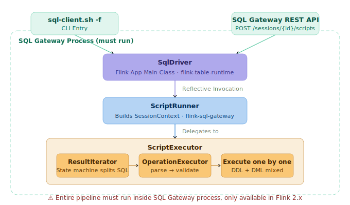
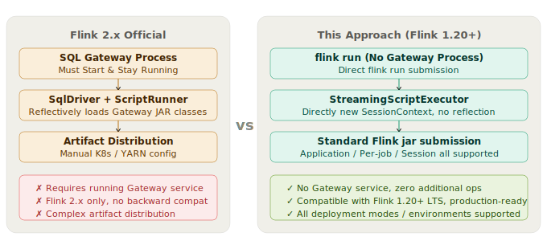
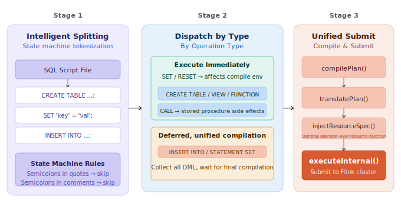

# Flink in Production: Use Flink SQL Like Hive

## Overview

This post introduces a method to **submit a multi-statement `.sql` file directly via `flink run` on Flink 1.20 (the widely-adopted LTS version).** It gives users a `hive -f my_etl.sql`-smooth Flink SQL development experience.

This approach works on any infrastructure (Local, YARN, Kubernetes) and any deployment mode (Standalone, Session, Application), and even supports both Flink 1.20.x and Flink 2.x simultaneously. Drawing on my experience at a major tech company, I'll share how large-scale internal real-time platforms handle this, and provide a new way of thinking.

## The Hive Development Pattern We Miss

Anyone who has used Hive remembers the "one command does everything" feeling:

```bash
hive -f my_etl.sql
```

A single `.sql` file with `CREATE TABLE`, `SET` parameters, and `INSERT INTO` all together — write it, run it. The script is your job. It can go into Git, receive Code Reviews, and be version-controlled. **SQL script file-ization is the fundamental prerequisite for data warehouse governance.**

## The Flink Community Landscape

### Flink 1.20 Approaches

**Option 1: SQL Client Interactive Mode**

Start the SQL Client, enter SQL statements one by one:

```bash
$FLINK_HOME/bin/sql-client.sh
Flink SQL> CREATE TABLE ods_orders (...);
Flink SQL> CREATE TABLE dwd_orders (...);
Flink SQL> INSERT INTO dwd_orders SELECT ... FROM ods_orders ...;
```

This is how most people get started — great for exploration and debugging. But tables must be rebuilt every time, DDL and DML are completely separated, and it cannot be automated.

**Option 2: SQL Client `-f` Mode**

The SQL Client supports specifying a SQL file with `-f`:

```bash
$FLINK_HOME/bin/sql-client.sh -f my_etl.sql
```

This looks close to Hive. The problem is: **SQL Client's `-f` only supports Standalone or Session modes.** Session clusters are typically not used for large-scale production workloads — resources are shared and subject to contention. Production environments need Per-job Mode or Application Mode, but `-f` supports neither.

**Option 3: `flink run` with Single SQL Statements**

This is the most familiar approach (the `DataStream` submission pattern). But Flink natively only accepts **single SQL statements** (via `TableEnvironment#executeSql()`):

```java
// Users must write Java code to wrap SQL
TableEnvironment tEnv = TableEnvironment.create(env);
tEnv.executeSql("CREATE TABLE ods_orders (...)");
tEnv.executeSql("INSERT INTO dwd_orders SELECT ...");
```

This means: to run Flink SQL in Application/Per-job Mode, you either write Java wrapper code for each statement, or tolerate Session mode limitations. Want to put DDL and business logic in one `.sql` file and execute with a single command? Not natively supported.

### The Community's Exploration: FLIP-316/480

The community also recognized the pain of not being able to submit SQL scripts in Application Mode. [FLIP-316](https://cwiki.apache.org/confluence/display/FLINK/FLIP-316%3A+Support+application+mode+for+SQL+Gateway) and [FLIP-480](https://cwiki.apache.org/confluence/display/FLINK/FLIP-480%3A+Support+to+deploy+SQL+script+in+application+mode) are two generations of community proposals in this direction.

* **FLIP-316 (unimplemented)**: SQL Gateway generates a JSON Plan, with `SqlDriver` on the JobManager side handling execution. Proposed in October 2024, no substantive progress since — **still shelved.**
* **FLIP-480 (implemented, Flink 2.x)**: A different approach — no pre-compilation; **compilation is deferred to the JobManager side.**

```
User SQL Script → SQL Gateway (receives request, launches JM)
                      ↓
              SqlDriver (JM bootstrap class, in flink-table-runtime)
                      ↓
              Reflectively invoke ScriptRunner (in flink-table-sql-gateway)
                      ↓
              ScriptRunner builds SessionContext, delegates to ScriptExecutor
```

But FLIP-480 also doesn't solve the fundamental problem: **you still need a running SQL Gateway service.** Worse still: this capability **only starts from Flink 2.x**, which introduces massive, **backwards-incompatible** refactoring from Flink 1.x. The industry is largely in a wait-and-see stance. The community acknowledges this, designating Flink 1.20.x as the LTS version.

## Using `.sql` Files Like Hive

Below I'll use the open-source implementation [flink-sql-bootstrap](https://github.com/tonyabasy/flink-sql-bootstrap) to explain usage, best practices, internals, and a do-it-yourself guide. You can reference the source code to build your own, or use it directly.

Let's see the end result — one `flink run` command runs a complete Word Count:

```bash
$FLINK_HOME/bin/flink run \
    --target local \
    /path/to/flink-sql-bootstrap.jar \
    --script-file classpath:example-word-count.sql
```

`flink-sql-bootstrap.jar` is a Flink Application with a `main()` class. `--script-file` specifies the SQL file and supports multiple protocols:

* **HTTP/HTTPS**: Commonly used for backend service integration or Git servers, e.g. `https://my-server/example.sql`
* **HDFS/S3**: Common in traditional big data environments, e.g. `hdfs://flink/scripts/example.sql`
* **Local**: For local testing or deployed scripts, e.g. `file:///Users/flink/scripts/example.sql`
* **Classpath**: Limited to examples bundled in `flink-sql-bootstrap.jar`, e.g. `classpath:example-word-count.sql`

*See `--help` for additional parameters, or refer to the project [README](https://github.com/tonyabasy/flink-sql-bootstrap/blob/main/README.md).*

And inside `example-word-count.sql`, DDL and DML coexist:

```sql
-- Source: datagen auto-generates sentences
CREATE TEMPORARY TABLE source_table (
  sentence STRING
) WITH (
  'connector' = 'datagen',
  'rows-per-second' = '1'
);

-- Sink: print to console
CREATE TEMPORARY TABLE sink_table (
  word STRING,
  cnt BIGINT
) WITH (
  'connector' = 'print'
);

-- One INSERT handles tokenization + grouping
INSERT INTO sink_table
SELECT word, COUNT(*) AS cnt
FROM source_table
CROSS JOIN UNNEST(SPLIT(sentence, ' ')) AS t(word)
GROUP BY word;
```

Console output immediately:

```
+I[hello, 1]
+I[world, 2]
+I[flink, 1]
...
```

That's it. DDL table creation and DML query — one script, one `flink run` command.

## Best Practices: Engineering SQL Scripts

Based on real-world project experience, here are a few recommendations:

### 1. Directory Structure

```
warehouse-example/
├── data/                           # ODS test data
│   └── ods_orders.csv
├── lib/                            # Dependency JARs
│   └── flink-sql-bootstrap-1.0.0.jar
├── scripts/                        # Helper scripts
│   └── generate_orders_test_data.py
├── result/                         # SQL script output
│   ├── dwd_orders/dt=yyyyMMdd/
│   └── ads_user_amount/dt=yyyyMMdd/
└── warehouse/                      # SQL business logic
    └── orders/
        ├── dwd_orders_di.sql       # DWD: cleaning + enrichment
        └── ads_user_amount_di.sql  # ADS: user aggregation
```

> Each example is a self-contained directory, top-level named by scenario (e.g. `warehouse-example`), internally organized as data/ lib/ scripts/ result/ warehouse/.

Small projects can use monolithic scripts (DDL+DML in one file); large projects split DDL and DML by layer.

See the full examples repo: [flink-sql-bootstrap-examples](https://github.com/tonyabasy/flink-sql-bootstrap-examples).

### 2. Comments as Documentation

SQL scripts should be treated like code repositories, with clear comments:

- File header: purpose, upstream/downstream dependencies, alert contacts
- Table-level: business meaning of each table
- Key logic: window definitions, complex JOIN conditions, UDF usage

### 3. Externalize Parameters

Environment-specific parameters (Kafka addresses, database connections, Checkpoint intervals) should be declared with `SET` in the SQL script rather than scattered across `flink-conf.yaml`. This keeps scripts self-contained — deploying to a new environment is immediately clear.

### 4. Use Dry-Run Modes for Syntax Validation

In CI or before submission, use dry-run mode to quickly validate SQL syntax without connecting to a cluster.

```bash
flink run path/to/flink-sql-bootstrap.jar --script-file jobs/etl_orders.sql --validate
```

This parses all statements, validates each one, with errors reported at exact line and column numbers. When building your own, call `parser.parse(sql)` before submission to check each `Operation`.

## Internals: How SQL Scripts Are "Split → Executed → Compiled"

### Deep Dive: How Flink 2.x Does It

Opening up the Flink 2.x source, the complete execution chain for SQL scripts in Application Mode:



<p align="center"><em>Fig 1 · Flink 2.x SQL Script Application Mode Complete Pipeline</em></p>

Key roles:
- **`SqlDriver`**: Deployed in `flink-table-runtime`, serves as Flink App Main bootstrap class, reflectively loads `ScriptRunner` from `$FLINK_HOME/opt/flink-sql-gateway-*.jar`
- **`ScriptRunner`**: Deployed in `flink-sql-gateway` module, builds `SessionContext` runtime
- **`ScriptExecutor`**: Core executor, uses an internal `ResultIterator` state machine to split SQL, then delegates to `OperationExecutor` for parsing and execution

## The Solution: Following the Community Roadmap, Backporting Flink 2.x to 1.x

Those familiar with the Flink SQL Gateway architecture evolution will notice:

**Since its introduction in Flink 1.16, the core pipeline `SessionContext → OperationExecutor → Planner` has been the foundation of all Flink SQL parsing, validation, compilation, and execution.** The `parse → validate → compile → execute` path for single SQL statements has remained highly stable from 1.x to 2.x, with changes mainly in interface signatures and deployment mode support.

This means: **you don't need to modify SQL execution logic — only minor compatibility work is needed to bring Flink 2.x's SQL file execution capability to 1.20.**

### Two Paths: Official vs. This Approach



<p align="center"><em>Fig 2 · Official (Flink 2.x) vs. This Approach (Flink 1.20+) Key Differences</em></p>

Specifically, our approach stays aligned with the community trajectory:

- **Reuse Flink 2.2.0's `ScriptExecutor` Multi-Statement splitting logic** (character-by-character scanning, state machine handling of quotes and comments, semicolon boundaries)
- **Remove Gateway service dependency**: only use `flink-sql-gateway` as a library JAR in the classpath, no Gateway process. `SessionContext`, `OperationExecutor` etc. are built at job startup alongside the Flink Application
- **The only tweak**: the original `ScriptExecutor` executes statements one-by-one as it splits them; we defer DML (`INSERT INTO` / `STATEMENT SET`) to the end for unified compilation. This not only makes execution order more controllable, but also paves the way for fine-grained resource tuning and CI/CD integration (topics for future articles)

> On fine-grained resource tuning and CI/CD for Flink SQL: these are enterprise-grade capabilities.
> - CI/CD: brings SQL jobs into the same engineering governance as backend code — version control, Code Review, automated validation (SQL syntax, table references, field references)
> - Fine-grained resource tuning: makes Flink SQL Job resource configuration as flexible as DataStream, dramatically saving production resources

Flink natively doesn't accept Multi-Statement SQL, so script splitting and orchestration must be implemented. **The splitter directly reuses Flink 2.2.0's `ScriptExecutor` state machine** (character-by-character scanning, correctly handling semicolons within single/double/backtick quotes and comments). DDL/DML dispatching is done by checking the `Operation` object type. The core engine `StreamingScriptExecutor`'s workflow has three stages.



<p align="center"><em>Fig 3 · Three-Stage Multi-Statement SQL Processing</em></p>

### Stage 1: Intelligent Tokenization

`StreamingScriptExecutor` contains a state-machine-driven SQL tokenizer `ResultIterator` that scans the script character by character:

- **Semicolons within single quotes `'...'`, double quotes `"..."`, backticks `` `...` `` are treated as literals**, not delimiters
- **Semicolons within single-line `--` and multi-line `/* */` comments are skipped**
- **Only top-level (non-quoted, non-comment) semicolons are recognized as statement boundaries**

This means you can write `';'` in strings and `-- use ';' to split` in comments without causing incorrect splitting.

### Stage 2: Type-Based Dispatch

Each split statement is parsed into a Flink `Operation` object, then dispatched based on type:

| Statement Type | Strategy | Reason |
|:---------------|:---------|:-------|
| `SET` / `RESET` | **Execute immediately** | Affects the compilation environment for subsequent statements |
| `CREATE TABLE` / `CREATE VIEW` / `CREATE FUNCTION` (DDL) | **Execute immediately** | Subsequent DML statements may reference these Catalog objects |
| `CALL` | **Execute immediately** | Stored procedure side effects must take effect immediately |
| `INSERT INTO` / `STATEMENT SET` (DML) | **Defer to unified compilation** | This is the actual Flink Job to submit; translation must complete before resource injection |

This is the core design philosophy: **DDL executes immediately, DML is deferred for batch compilation.** DDL must first land in the in-memory Catalog so subsequent DML parsing can reference those tables; DML is delayed until all DDL is done, then compiled together, yielding a complete Transformation DAG and providing necessary context for DML parsing, validation, and compilation.

### Stage 3: Unified Submission

After all DDL is executed and all DML is collected, `StreamingScriptExecutor` calls Flink Table Planner (`flink-table-planner` JAR) standard interfaces: `compilePlan()` compiles SQL into a logical execution plan, `translatePlan()` translates it into a `Transformation` DAG, then (optionally) injects per-operator resource configuration, and finally submits via `executeInternal()`.

The full pipeline:

```
SQL Script → Split → [DDL: execute immediately] → Collect DML → compilePlan → translatePlan
                                                                ↓
                                                       injectResourceSpec
                                                                ↓
                                                       executeInternal → Flink Cluster
```

## DIY Guide (If You'd Rather Build Than Use)

Now that you understand the internals, here's what you need to handle to build it yourself. The `flink-sql-bootstrap` source is available for reference.

### 1. Dependency Management: Why You Need `flink-sql-gateway`

Since its introduction in Flink **1.16**, Flink SQL Gateway has been the standard entry point for all Flink SQL parsing, validation, compilation, and execution. To build Multi-Statement execution capability, the key dependencies are:

| Maven Dependency | Core Capability |
|:-----------------|:----------------|
| `org.apache.flink:flink-sql-gateway` | `SessionContext`, `OperationExecutor`, `SessionEnvironment` |
| `org.apache.flink:flink-table-runtime` | `Planner`, `TableEnvironmentImpl` |
| `org.apache.flink:flink-table-planner` | Compilation and optimization |

**Why can't you bypass this system?** These classes serve these roles:
- `SessionContext` (Session management): manages UDF classloaders, Catalog registration, and Session-level configuration
- `OperationExecutor` (SQL operation execution): encapsulates the standard `parse → validate → compile` pipeline
- `Planner` (SQL compilation/optimization): compiles `Operation` into an executable Flink Job

These three together guarantee Flink SQL semantic compatibility. Building your own from scratch is not only a massive effort, but risks drifting from the community's SQL syntax evolution.

Fortunately, this dependency doesn't require starting a Gateway service process — these are just classes in the `flink-sql-gateway-*.jar`, which can be directly `new`ed in code.

### 2. Flink 1.20.x Compatibility Patches

While the core pipeline (`parse → validate → compile → execute` for single SQL statements) has remained stable between 1.x and 2.x, there are interface-level incompatibilities. For Flink 1.20.x, the following issues need handling:

**① URI → URL Conversion Bug in `SessionContext` ([FLINK-39687](https://issues.apache.org/jira/browse/FLINK-39687))**

Flink 2.2.0's `SessionContext.create()` directly casts `List<URI>` to `URL[]` when building the `userClassLoader`, causing `ArrayStoreException` when the dependency list is non-empty. Fix: create a `UriSafeSessionContext` extending `SessionContext`, converting each URI individually:

```java
// Fix: convert each URI to URL individually
URL[] urls = dependencies.stream()
    .map(URI::toURL)
    .toArray(URL[]::new);
```

> Reference: [`UriSafeSessionContext.java`](https://github.com/tonyabasy/flink-sql-bootstrap/blob/main/src/main/java/com/lanting/flink/sql/bootstrap/flink/UriSafeSessionContext.java)

**② `ApplicationOperationExecutor` — Application Mode Executor Adaptation**

`ApplicationOperationExecutor` is the `OperationExecutor` subclass for Application Mode, managing the `TableEnvironment` lifecycle (in Application Mode, the Flink environment is created by the framework, not by user code).

Flink uses Java SPI (`ServiceLoader`) to automatically discover the appropriate `ExecutorFactory` for the current mode. In Flink 1.20, `EmbeddedExecutorFactory.isCompatibleWith()` has a defect preventing matching in Application Mode. Solution: **build your own `ApplicationOperationExecutor`**. The key is `getTableEnvironment()` calling `StreamExecutionEnvironment.getExecutionEnvironment()` — this static method directly returns the Flink framework's current `StreamExecutionEnvironment` instance (regardless of mode), bypassing the Factory matching issue.

> Reference: [`ApplicationOperationExecutor.java`](https://github.com/tonyabasy/flink-sql-bootstrap/blob/main/src/main/java/com/lanting/flink/sql/bootstrap/flink/ApplicationOperationExecutor.java)

**③ Output Formatting Adaptation**

Flink 2.x added a `getPrintStyle()` method to `ResultFetcher` that doesn't exist in 1.20. Build your own `Printer` that constructs `TableauStyle` from `ResolvedSchema` for formatted output.

> Reference: [`Printer.java`](https://github.com/tonyabasy/flink-sql-bootstrap/blob/main/src/main/java/com/lanting/flink/sql/bootstrap/executor/Printer.java)

### 3. Building the Submission Pipeline

With dependencies and compatibility sorted, here's the core submission skeleton. Comments indicate which classes are Flink built-ins and which are custom:

```java
DefaultContext defaultContext = new DefaultContext(configuration);
SessionEnvironment ssEnv = SessionEnvironment.newBuilder()
    .setSessionEndpointVersion(SqlGatewayRestAPIVersion.getDefaultVersion())
    .build();

// UriSafeSessionContext: fixes FLINK-39687 URI→URL conversion (custom)
SessionContext sessionContext = UriSafeSessionContext.create(
    defaultContext, dependencies, sessionHandle, ssEnv, executor);

// StreamingScriptExecutor: SQL splitting + DDL/DML dispatch + resource injection (custom)
StreamingScriptExecutor executor = new StreamingScriptExecutor(
    sessionContext, sqlScript, resourceConfig, printer);

// Execution modes
executor.validate(script);    // Validate syntax only
executor.compile(script);     // Validate + compile (no submit)
executor.execute();           // Full execution (split→DDL→compile→inject→submit)
```

> Reference: [`SqlEntryPoint.java`](https://github.com/tonyabasy/flink-sql-bootstrap/blob/main/src/main/java/com/lanting/flink/sql/bootstrap/SqlEntryPoint.java)

## Summary

The core assertion of this article is simple: **use `flink-sql-gateway` JARs as a Flink SQL App Template**, add a few compatibility patches, and you get Flink 2.x's Multi-Statement script execution capability on Flink 1.20 LTS — working across all deployment modes and runtime environments. Future articles will cover the fine-grained resource tuning and CI/CD integration built on this foundation.

## References

- [FLIP-316: Support Application Mode for SQL Gateway](https://cwiki.apache.org/confluence/display/FLINK/FLIP-316%3A+Support+application+mode+for+SQL+Gateway)
- [FLIP-480: Support to Deploy SQL Script in Application Mode](https://cwiki.apache.org/confluence/display/FLINK/FLIP-480%3A+Support+to+deploy+SQL+script+in+application+mode)
- [Flink 2.2 SQL Gateway — Deploying a Script](https://nightlies.apache.org/flink/flink-docs-stable/docs/dev/table/sql-gateway/overview/)
- [Flink 2.0 Release Notes](https://nightlies.apache.org/flink/flink-docs-stable/release-notes/flink-2.0/)
- [FLINK-39687: URI used as URL in SessionContext causes ArrayStoreException](https://issues.apache.org/jira/browse/FLINK-39687)

*This article is based on [github - flink-sql-bootstrap](https://github.com/tonyabasy/flink-sql-bootstrap) & [gitee - flink-sql-bootstrap](https://gitee.com/tonyabasy/flink-sql-bootstrap)*

## About the Author

🙋 Former Alibaba Data Engineer, focused on real-time engines, platforms, and applications.

👏 Feedback and discussion on real-time application development are welcome — I'll do my best to help. How to reach me:

- Submit an [Issue](https://github.com/tonyabasy/flink-sql-bootstrap/issues)
- Email: [tonyabasy@163.com](mailto:tonyabasy@163.com)

👏 Contributions to [flink-sql-bootstrap](https://github.com/tonyabasy/flink-sql-bootstrap) are welcome.
