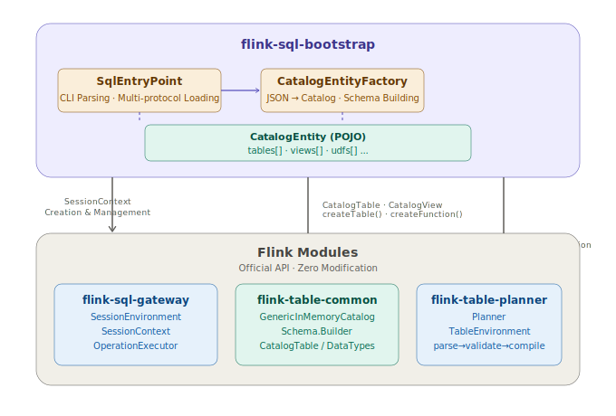

# Flink in Production: Catalog Snapshots — Write Your DDL Once

## Overview

The first two articles solved two things: **how to run** ([Use Flink SQL Like Hive](01-hive-like-flink-sql.md)), and **how to manage** ([CI/CD Like a Backend Service](02-cicd-pipeline.md)).

In traditional Flink SQL, **DDLs are scattered across every SQL script**. A real-time data warehouse has dozens of tables, and each table's `CREATE TABLE` appears in every script that references it. Change one field type, and every script must be updated. This is why you need a **metadata hub**.

The **Catalog Snapshot** introduced in this article solves exactly this: decouple DDL from SQL scripts, serialize it into a self-contained JSON file, and automatically restore it to an in-memory Catalog at job startup. **Write DDL once, share it across all jobs.**

This article dives deep into the design rationale and underlying principles of Catalog Snapshots — **why it must be a "snapshot," how to achieve full DDL semantic compatibility on top of Flink's existing APIs**, and how to build it yourself if you prefer not to use [flink-sql-bootstrap](https://github.com/tonyabasy/flink-sql-bootstrap) directly.

## Core Idea: Why a "Snapshot"?

Let's start with what a snapshot looks like. Here's a minimal version — just two tables and two UDFs:

```json
{
  "version": 1,
  "snapshotId": "20240622-155500-a1b2",
  "catalogName": "platform",
  "databaseName": "default",
  "tables": [
    {
      "database": "default",
      "name": "ods_words",
      "columns": [
        { "name": "sentence", "type": "STRING", "nullable": true }
      ],
      "options": {
        "connector": "datagen",
        "rows-per-second": "1"
      }
    },
    {
      "database": "default",
      "name": "dws_word_count",
      "columns": [
        { "name": "word", "type": "STRING", "nullable": false },
        { "name": "cnt", "type": "BIGINT", "nullable": false }
      ],
      "options": {
        "connector": "print"
      }
    }
  ],
  "views": [],
  "udfs": [
    {
      "name": "my_reverse",
      "className": "examples.udf.MyReverseFunction",
      "functionLanguage": "JAVA",
      "jarRef": "example-udf-reverse.jar"
    },
    {
      "name": "my_substring",
      "className": "examples.udf.MySubstringFunction",
      "functionLanguage": "JAVA",
      "jarRef": "example-udf-substring.jar"
    }
  ]
}
```

Paired with this snapshot, the SQL script **no longer needs any DDL**:

```sql
INSERT INTO dws_word_count
SELECT my_reverse(my_substring(word, 0, 2)) AS word, COUNT(*) AS cnt
FROM ods_words
CROSS JOIN UNNEST(SPLIT(sentence, ' ')) AS t(word)
GROUP BY my_reverse(my_substring(word, 0, 2));
```

As you can see, all tables and UDFs come from the Catalog Snapshot. The SQL script contains **zero DDL** — only business logic.

So why not use Flink's built-in Catalogs directly? `GenericInMemoryCatalog` is purely in-memory and vanishes when the process restarts. `HiveCatalog` can persist to Hive Metastore, but requires deploying an HMS service. Same story with `JDBCCatalog`. These Catalogs all need to connect to a "live" metadata center at startup and always fetch the **latest** DDL.

**The Catalog Snapshot is designed for restart idempotency.** Imagine this scenario: your Flink job has been running for three weeks and needs a restart due to cluster maintenance. But during those three weeks, an upstream team changed a field type in the ODS table. If you pull the latest DDL from a "live" metadata center on restart, you get the new schema — which doesn't match the state saved in your Checkpoint. At best, the job fails to start. At worst, it silently recovers and produces incorrect data.

The Catalog Snapshot solves this: **freeze the DDL at deployment time into an immutable JSON file.** What it looked like at deployment is what it will look like on restart. That's why this JSON should go into Git alongside your SQL scripts — the complete metadata state at deployment time is locked in forever.

> In flink-sql-bootstrap, the snapshot's **immutability is a convention, not enforced by code — only a `snapshotId` is defined in the Catalog**. flink-sql-bootstrap handles decoupling DDL from SQL scripts. You are responsible for keeping that DDL unchanged throughout the deployment lifecycle — lock down the URL version, check it into Git alongside your scripts. For example, if you set up a REST service, the resource would be defined as `https://catalog-server/snapshot/{snapshot-id}`.

## Quick Start

Next, we'll walk through the Catalog Snapshot experience using flink-sql-bootstrap and its built-in examples.

You'll need to download the JAR from [GitHub Releases](https://github.com/tonyabasy/flink-sql-bootstrap/releases) and ensure `flink-sql-gateway-*.jar` is in `${FLINK_HOME}/lib` (copy it from `${FLINK_HOME}/opt`).

A complete deployment command with a Catalog Snapshot:

```bash
$FLINK_HOME/bin/flink run \
    --target local \
    flink-sql-bootstrap-${version}.jar \
    --script-file classpath:example-word-count-advanced.sql \
    --catalog-file classpath:example-catalog.json \
    --dependency classpath:example-udf-reverse.jar \
    --dependency classpath:example-udf-substring.jar
```

Here `example-catalog.json` is the snapshot shown above, and `example-word-count-advanced.sql` is the DML-only script:

```sql
INSERT INTO dws_word_count
SELECT my_reverse(my_substring(word, 0, 2)) AS word, COUNT(*) AS cnt
FROM ods_words
CROSS JOIN UNNEST(SPLIT(sentence, ' ')) AS t(word)
GROUP BY my_reverse(my_substring(word, 0, 2));
```

These example files are bundled inside the JAR — no additional preparation needed.

Like `--script-file`, `--catalog-file` supports five protocols: `classpath:`, `file://`, `http(s)://`, `hdfs://`, `s3://`. `--dependency` is used to load UDF JARs.

Output after execution:

```
+I[6a, 1]
+I[00, 1]
+I[a3, 1]
+I[8f, 1]
```

The combined effect of UDFs `my_reverse` and `my_substring` is: reversing the first two characters of each word. Throughout the entire process, the SQL script contains no `CREATE TABLE` or `CREATE FUNCTION`. All DDL comes from the Catalog Snapshot.

## How Does Flink SQL Bootstrap Do It?

Before diving into how flink-sql-bootstrap works, let's briefly explain what a Flink Catalog is.

When Flink SQL parses `SELECT * FROM orders`, where does the `orders` table come from? The answer is the **Catalog** — Flink's metadata registry. It stores all available table schemas, view definitions, and UDFs for the current session. When you `CREATE TABLE` in the SQL Client, you're essentially registering a piece of metadata in the current Catalog.

The core Catalog APIs are just a few: `createDatabase()`, `createTable()`, `createFunction()`. What flink-sql-bootstrap does is straightforward — **translate the JSON snapshot into these metadata entries and call the `createXXX()` APIs to build the Catalog**. The overall architecture is shown below.



`CatalogEntity` is the "data," `GenericInMemoryCatalog` is the "warehouse," and `SessionEnvironment` mounts the warehouse onto the SQL engine. The restoration process — where `CatalogEntityFactory` moves data from the entity into the warehouse — consists of five steps, with step three (table registration) being the core:

1. `new GenericInMemoryCatalog(name, db)` — create an empty in-memory Catalog
2. `createDatabase(db, ...)` — ensure the default database exists
3. Iterate over `tables`, convert each `TableEntity` to a `CatalogTable`, and call `createTable()`
4. Iterate over `views`, convert each `ViewEntity` to a `CatalogView`, and call `createTable()`
5. Iterate over `udfs`, convert each `UdfEntity` to a `CatalogFunctionImpl`, and call `createFunction()`

### The Remaining Steps: Register, Mount, Execute

A registered Catalog is just data — it still needs to be mounted onto the SQL engine. In `SqlEntryPoint`, the complete chain works as follows:

**Step 1: Register the Catalog with `SessionEnvironment`.**

```java
SessionEnvironment.Builder builder = SessionEnvironment.newBuilder()
        .setSessionEndpointVersion(SqlGatewayRestAPIVersion.getDefaultVersion());
if (catalogJson != null) {
    // CatalogEntityFactory deserializes JSON → CatalogEntity, then registers each table/UDF into GenericInMemoryCatalog
    GenericInMemoryCatalog catalog = CatalogEntityFactory.from(catalogJson);
    // Register and set as default Catalog
    builder.registerCatalog(catalog.getName(), catalog)
            .setDefaultCatalog(catalog.getName());
}
SessionEnvironment ssEnv = builder.build();
```

`SessionEnvironment` is Flink SQL Gateway's session environment abstraction, managing all Catalogs mounted under the current session. If a snapshot is provided, the snapshot-generated Catalog is registered; otherwise, DDL statements within the SQL script handle table creation.

**Step 2: Build the `SessionContext`.**

```java
SessionHandle sessionHandle = new SessionHandle(UUID.randomUUID());
SessionContext sessionContext = UriSafeSessionContext.create(
        defaultContext, dependencies, sessionHandle, ssEnv, Executors.newDirectExecutorService());
```

`SessionContext` is Flink SQL Gateway's session context, binding together the `SessionEnvironment` (Catalog), `DefaultContext` (Flink configuration), and the UDF JARs' `ClassLoader`. At this point, the SQL engine has full metadata and an execution environment.

**Step 3: Delegate to `StreamingScriptExecutor`.**

```java
StreamingScriptExecutor executor = new StreamingScriptExecutor(
        sessionContext, sqlScript, resourceConfig, new Printer(System.out));
executor.execute();  // Split SQL → execute DDL immediately → compile DML → submit
```

`StreamingScriptExecutor` is a custom implementation in flink-sql-bootstrap, modeled after the platform's `ScriptExecutor` (Flink 2.x). It is the **absolute core** — rebuilt from scratch to support SQL validation, compilation, lineage building, fine-grained resource injection, Flink 1.x compatibility, and more.

Once `StreamingScriptExecutor` receives the `SessionContext`, it can look up tables and UDFs in the Catalog via `OperationExecutor` when parsing SQL. For example, `SELECT * FROM ods_words` — `ods_words` is already in the Catalog from step one. No DDL needed, and the SQL engine works just fine.

## DIY Guide

If you want to build the same capability yourself, it boils down to two things:

**1. JSON → Catalog restoration.** Define your own entity model, iterate over tables/views/UDFs, and call `GenericInMemoryCatalog`'s `createTable()` / `createFunction()` APIs one by one. The key details: Schema build order (physical columns → metadata columns → computed columns → Watermark → primary key) must match Flink's internal order exactly, and type strings should be delegated directly to `DataTypes.of(String)` for parsing.

**2. Catalog → SessionEnvironment → SessionContext.** This chain is the standard entry point for Flink SQL Gateway. Simply reuse `SessionEnvironment.Builder` and `UriSafeSessionContext` (or handle 1.20.x compatibility yourself) — no need to reinvent the wheel.

> Reference source: [CatalogEntityFactory.java](https://github.com/tonyabasy/flink-sql-bootstrap/blob/main/src/main/java/com/lanting/flink/sql/bootstrap/catalog/CatalogEntityFactory.java), [SqlEntryPoint.java](https://github.com/tonyabasy/flink-sql-bootstrap/blob/main/src/main/java/com/lanting/flink/sql/bootstrap/SqlEntryPoint.java), [StreamingScriptExecutor.java](https://github.com/tonyabasy/flink-sql-bootstrap/blob/main/src/main/java/com/lanting/flink/sql/bootstrap/executor/StreamingScriptExecutor.java)

## Summary

The core assertion of this article is simple: **decouple DDL from SQL scripts and freeze it into an immutable JSON snapshot** — so that table schemas, views, and UDFs are written once and shared across all jobs. The snapshot goes into Git alongside your SQL scripts; the complete metadata state at deployment time is locked in forever. Job restarts no longer depend on a "live" metadata center, completely eliminating recovery failures caused by Schema drift.

*Based on [Flink SQL Bootstrap](https://github.com/tonyabasy/flink-sql-bootstrap) and its built-in examples*

## About the Author

🙋 Former Alibaba Data Engineer, focused on real-time engines, platforms, and applications.

👏 Feedback and discussion on real-time application development are welcome — I'll do my best to help. How to reach me:

- Submit an [Issue](https://github.com/tonyabasy/flink-sql-bootstrap/issues)
- Email: [tonyabasy@163.com](mailto:tonyabasy@163.com)

👏 Contributions to [flink-sql-bootstrap](https://github.com/tonyabasy/flink-sql-bootstrap) are welcome.
