# Flink in Production: Fine-Grained Resource Management for SQL

## Overview

The first three articles solved three things: **how to run** ([Use Flink SQL Like Hive](01-hive-like-flink-sql.md)), **how to manage** ([CI/CD Like a Backend Service](02-cicd-pipeline.md)), and **how to reuse DDL** ([Catalog Snapshots — Write Your DDL Once](03-catalog-snapshot.md)).

This article tackles the fourth: **how to save**.

Flink 1.6 introduced [Fine-Grained Resource Management](https://nightlies.apache.org/flink/flink-docs-release-2.2/docs/deployment/finegrained_resource/), which dramatically improves resource utilization for large-scale, high-parallelism jobs. However, up to version 2.x, this capability is limited to DataStream — Flink SQL users are left out.

This article walks you through the fundamentals of Flink resource management, the benefits of fine-grained control, and how to achieve it. Here's what we'll cover:

- What is fine-grained resource management, how does it work, and what are the gains?
- Which jobs benefit from it, and when is coarse-grained sufficient?
- How to use this feature in Flink SQL via flink-sql-bootstrap.
- Where to start if you want to build it yourself.

## Flink Resource Management Fundamentals

### Core Concepts

To set the stage, let's briefly revisit the key concepts. For a deeper dive, refer to the [Flink Architecture](https://nightlies.apache.org/flink/flink-docs-release-2.2/docs/concepts/flink-architecture/) and [Fine-Grained Resource Management](https://nightlies.apache.org/flink/flink-docs-release-2.2/docs/deployment/finegrained_resource/) docs.

In a nutshell, Flink resource management is the process that kicks in after `flink run` — it analyzes the resources the job needs and requests them from the resource manager (YARN, Kubernetes, or Local). The diagram below is Flink's classic illustration of how your code runs inside a Flink cluster.


- **TaskManager (green box)**: A Flink worker node, essentially a JVM process. A single machine can run multiple TMs, each responsible for executing tasks.
- **Slot (blue box)**: The smallest resource container within a TM. A TM is partitioned into multiple slots, each consuming a portion of the TM's CPU and memory. **The Slot is the minimum unit of Flink resource scheduling and task execution.**
- **Task (dashed box)**: A parallel instance of an operator. If Source has parallelism 64, there are 64 Tasks, each running in one Slot.
- **Operator Chain (yellow box)**: Flink's optimization — merging operators without shuffle dependencies into a single Task to reduce thread switching and network overhead.

### The Resource Allocation Process

When a job starts, Flink builds operator chains and Tasks, then proceeds with resource allocation in two phases:

1. **Phase 1**: Tasks find suitable Slots.
2. **Phase 2**: Slots find suitable TaskManagers. If none are available, Flink requests new TMs from YARN/Kubernetes, then re-matches.

The diagram below contrasts **Coarse-Grained** and **Fine-Grained** resource management. Our assumptions:

- Three operator chains (`A[Source & Filter] -> B[WindowAgg] -> C[Sink]`)
    - A: parallelism=64, CPU=0.5C, memory=1GB
    - B: parallelism=4, CPU=2C, memory=4GB (aggregation needs more resources)
    - C: parallelism=4, CPU=0.5C, memory=1GB
- Coarse-grained: 4 slots per TM
- Fine-grained: 12C + 24GB per TM
- Fine-grained: 3 user-defined SlotSharingGroups — `SSG-A`, `SSG-B`, `SSG-C`



**Coarse-Grained Resource Manager**: The SlotSharingGroup is not user-controllable — it uses the default SSG. **Whether SSG names match is what determines if operators share the same Slot.** Therefore, under coarse-grained mode, operators A, B, and C all share the same Slot. All slots have identical resource specs, and the slot count always equals the maximum parallelism: **64**.

- Phase 1: Tasks are assigned to Slots. Under the default load-balancing strategy, **subtask IDs map to corresponding slot IDs**:
    - A-subtask-0 -> slot-0, A-subtask-1 -> slot-1 ... A-subtask-63 -> slot-63
    - B-subtask-0 -> slot-0 ... B-subtask-3 -> slot-3
    - C-subtask-0 -> slot-0 ... C-subtask-3 -> slot-3
- Phase 2: Slots are packed into TMs. Under the default strategy, slots are allocated **sequentially in groups of 4 per TM**.

**Fine-Grained Resource Manager** differs in that **Slots have varying resource amounts**, and the SlotSharingGroups are user-specified (`SSG-A`, `SSG-B`, `SSG-C`). There is no need to assign Tasks to Slots (Phase 1). Under the **Slot balance** strategy, TMs are filled based on **remaining resources** — TMs with more free resources receive slots first. The result: each TM contains a **roughly equal distribution** of SSG-A, SSG-B, and SSG-C, as shown in the right-hand TaskManager view.

The gap in resource utilization is dramatic:

- Coarse-grained: 16 TMs, 23.8% utilization
- Fine-grained: 4 TMs, 87.5% utilization

### When to Use Fine-Grained Resources

Fine-grained resource management isn't for every scenario. When your operators have similar parallelism and comparable resource consumption, coarse-grained works perfectly well. Consider fine-grained only if your job meets one or both of these conditions:

- Large disparity in parallelism between operators: most Slots only run a subset of operators, wasting resources.
- Large disparity in resource demands between operators: TMs must be sized for the heaviest operator, so many Slots are over-provisioned.

## Fine-Grained Resources in Flink SQL

Flink SQL jobs contain plenty of ETL and aggregation logic with uneven parallelism. For example:

- Massive upstream data that needs to be filtered down for analysis: Source and Filter operators demand high parallelism, while aggregation and Sink operators need far less.
- Long-window joins or aggregations: WindowAgg and Join operators need substantial memory, but Source and Sink need very little.
- GPU-accelerated operators: Calc operators running GPU-dependent UDFs for image processing need precious GPU resources, but Source and Sink don't.

These three scenarios are prime candidates for fine-grained resource management. Yet Flink's official fine-grained support is **DataStream-only** — leaving countless Flink SQL jobs with poor resource utilization. Switching to DataStream means higher development and iteration costs.

[flink-sql-bootstrap](https://github.com/tonyabasy/flink-sql-bootstrap) was built to solve this: **bring fine-grained resource management to Flink SQL**. All it takes is one JSON file describing each operator's resource requirements, injected at submission time.

### Quick Start

Download the JAR from [GitHub Releases](https://github.com/tonyabasy/flink-sql-bootstrap/releases) and ensure `flink-sql-gateway-*.jar` is in `${FLINK_HOME}/lib`.

#### Step 1 — Generate a Resource Template

`--init-resource` analyzes your SQL script, identifies all operators, and outputs a resource template:

```bash
$FLINK_HOME/bin/flink run \
    --target local \
    flink-sql-bootstrap-${version}.jar \
    --script-file classpath:example-word-count.sql \
    --init-resource
```

Output:

```json
{
  "version" : 1,
  "operators" : [ {
    "uid" : "1_source",
    "name" : "source_table[1]",
    "parallelism" : 1,
    "chainStrategy" : "HEAD"
  }, {
    "uid" : "2_correlate",
    "name" : "Correlate[2]",
    "parallelism" : 1,
    "chainStrategy" : "ALWAYS"
  }, {
    "uid" : "3_calc",
    "name" : "Calc[3]",
    "parallelism" : 1,
    "chainStrategy" : "ALWAYS"
  }, {
    "uid" : "5_group-aggregate",
    "name" : "GroupAggregate[5]",
    "parallelism" : -1,
    "chainStrategy" : "ALWAYS"
  }, {
    "uid" : "6_sink",
    "name" : "sink_table[6]",
    "parallelism" : -1,
    "chainStrategy" : "ALWAYS"
  } ]
}
```

The template lists each operator's `uid`, `name`, current parallelism, and chain strategy. Your job now: **adjust parallelisms and add `resource` fields**.

#### Step 2 — Fill in Resource Specs

Here's the modified `resource.json`:

```json
{
  "version": 1,
  "defaultParallelism": 2,
  "operators": [
    {
      "uid": "1_source",
      "name": "source_table[1]",
      "parallelism": 4,
      "chainStrategy": "HEAD",
      "resource": { "profile": "stateless" }
    },
    {
      "uid": "5_group-aggregate",
      "name": "GroupAggregate[5]",
      "parallelism": 2,
      "chainStrategy": "ALWAYS",
      "resource": {
        "cpu": 1.0,
        "heap": "2048m",
        "managed": "256m"
      }
    },
    {
      "uid": "6_sink",
      "name": "sink_table[6]",
      "parallelism": 2,
      "chainStrategy": "ALWAYS",
      "resource": { "profile": "sink" }
    }
  ]
}
```

Key points:

- **`uid` is the matching key**: keep it consistent with the generated template.
- **`parallelism: -1` means "don't override"**: use Flink's default if unchanged.
- **`resource.profile`**: four preset tiers — `stateless` (0.5C/512MB), `stateful` (1C/2G/256MB managed), `join_heavy` (1C/4G/512MB managed), `sink` (0.5C/1G) — covering most scenarios.
- **Explicit values are also supported**: `cpu` + `heap` + `managed`, with units like `MB`, `m`, `g`.

#### Step 3 — Submit with Resource Specs

```bash
$FLINK_HOME/bin/flink run \
    --target local \
    flink-sql-bootstrap-${version}.jar \
    --script-file classpath:example-word-count.sql \
    --resource-file classpath:resource.json
```

The only difference from `--init-resource` is the last parameter. Now Source runs on 0.5C+512MB, Aggregate gets its own 1C+2G+256MB managed, and Sink runs light — **no more one-size-fits-all**.

## How It Works

At a high level, flink-sql-bootstrap injects resource specs right before submission: the SQL script goes through parse → validate → compile → translate to produce a `Transformation` DAG, then it **traverses the DAG, matches operators, injects resources**, and finally calls `executeInternal()` to submit. The full pipeline:

```
SQL Script → parse → validate → compile → translate → Transformation DAG
                                                         ↓
                                                  injectResourceSpec ← resource.json
                                                         ↓
                                                  executeInternal → cluster
```

Let's break down the key mechanisms.

### UID Generation: Why ALWAYS Mode Is Essential

`resource.json` relies on `uid` to match operators. If the uid changes every time you compile, the config file is useless.

Flink offers three UID generation modes:

| Mode | Behavior | Use Case |
|------|----------|----------|
| `DISABLED` | No UIDs generated | N/A |
| `PLAN_ONLY` | Generated during compilation, discarded on submission | Debugging |
| `ALWAYS` | Consistent across compilation and submission | **Production** |

flink-sql-bootstrap forces `ALWAYS` mode. The same SQL script, compiled any number of times on any machine, always produces identical uids for every operator. This is why you can confidently reference uids in the template produced by `--init-resource`.

### Matching: UID Exact → Name Fallback → Strict Error

Once the `Transformation` DAG is ready, each `PhysicalTransformation` (skipping virtual nodes like Partition and Union) is matched in the following order:

1. **UID exact match**: `resourceSpec.findByUid(transformation.getUid())`
2. **Name fallback**: if UID match fails, try `resourceSpec.findByName(transformation.getName())`
3. **Strict error**: if both fail, throw an exception — **every operator must be covered by the resource spec, no exceptions**

On a successful match, three injections take place:

- **UID override**: the configured `uid` replaces Flink's auto-generated value, ensuring savepoint alignment.
- **Parallelism injection**: priority is operator config > `defaultParallelism` > Flink config.
- **Chain strategy injection**: `ChainingStrategy` is set via reflection (`HEAD`/`ALWAYS`/`NEVER`).

### Resource Injection: Why Not `setResources()`?

This is the most critical design decision in the entire implementation.

Flink's `Transformation.setResources()` looks like the most direct injection method, but it has a fatal flaw: **it triggers the `isPartialResourceConfigured()` check**. This rule requires that if one vertex in the DAG has resources set, ALL vertices must have them set, otherwise it throws an exception.

That means if you only want to add memory to WindowAgg while leaving Source and Sink at their defaults, `setResources()` will fail.

flink-sql-bootstrap takes the **SlotSharingGroup** path instead:

```
setResources() path (❌ blocked):
  Transformation → isPartialResourceConfigured() check → exception

SlotSharingGroup path (✅ works):
  Transformation → SlotSharingGroup → StreamGraphGenerator
                                    ↓
                          slotSharingGroupResources
                                    ↓
                          JobVertex.setSlotSharingGroup()
```

Each operator gets a SlotSharingGroup based on its resource spec. Operators with identical resource specs are automatically grouped into the same SSG, preserving operator chaining. SSG names are generated by `OperatorResourceSpec.generateName()` as deterministic signatures (e.g., `cpu=0.5+heap=512MB` and `cpu=0.5+heap=512m` produce the same signature because memory units are normalized).

### Profile Presets

To lower the configuration barrier, four preset tiers are provided:

| Profile | CPU | Heap | Managed | Typical Use |
|---------|-----|------|---------|-------------|
| `stateless` | 0.5 | 512 MB | — | filter, map, simple transforms |
| `stateful` | 1.0 | 2048 MB | 256 MB | windowed aggregation, deduplication |
| `join_heavy` | 1.0 | 4096 MB | 512 MB | interval join, lookup join |
| `sink` | 0.5 | 1024 MB | — | jdbc sink, file sink |

For most scenarios, a `profile` is all you need. For finer control, switch to explicit `cpu`, `heap`, and `managed` values.

## Summary

Returning to the four questions from the overview, you should now have answers:

- **What is fine-grained resource management?** Breaking the default "all operators share one SlotSharingGroup" into multiple independent SSGs, each with its own resource spec — light for Source, heavy for Aggregate, no more one-size-fits-all.
- **Which jobs need it?** Those with large parallelism gaps or large resource demand gaps between operators. Conversely, when parallelism and resource needs are uniform, coarse-grained is sufficient.
- **How to use it in Flink SQL?** `--init-resource` to generate a template → edit the JSON → submit with `--resource-file`. Three steps.
- **How to build it yourself?** Three core tasks: force `ALWAYS` mode for deterministic UIDs → BFS-traverse the Transformation DAG and match operators → inject resources via the SlotSharingGroup path to bypass Flink's partial resource check.

This brings our four-part series to a close — from **how to run, how to manage, and DDL reuse, to how to save** — covering the four most critical aspects of production-grade Flink SQL deployment. We hope these articles help you avoid pitfalls and save costs on your real-time data warehousing journey.

*Based on [Flink SQL Bootstrap](https://github.com/tonyabasy/flink-sql-bootstrap) and its built-in examples*

## References

- [Flink Architecture](https://nightlies.apache.org/flink/flink-docs-release-2.2/docs/concepts/flink-architecture/)
- [Fine-Grained Resource Management](https://nightlies.apache.org/flink/flink-docs-release-2.2/docs/deployment/finegrained_resource/)
- [Balanced Task Scheduling](https://nightlies.apache.org/flink/flink-docs-release-2.2/docs/deployment/tasks-scheduling/balanced_tasks_scheduling/)
- [Flink SQL Balanced Task Scheduling — Chinese Edition](https://www.cnblogs.com/tonyabasy/p/20787370)

## About the Author

🙋 Former Alibaba Data Engineer, focused on real-time engines, platforms, and applications.

👏 Feedback and discussion on real-time application development are welcome — I'll do my best to help. How to reach me:

- Submit an [Issue](https://github.com/tonyabasy/flink-sql-bootstrap/issues)
- Email: [tonyabasy@163.com](mailto:tonyabasy@163.com)

👏 Contributions to [flink-sql-bootstrap](https://github.com/tonyabasy/flink-sql-bootstrap) are welcome.
