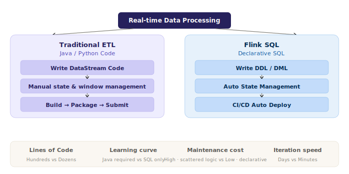
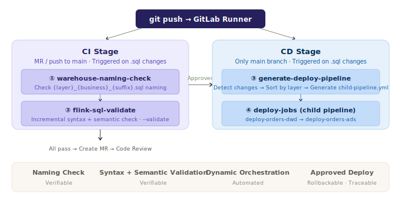
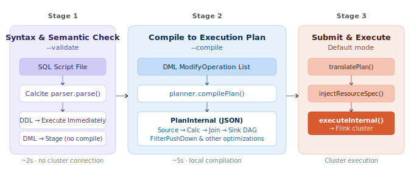
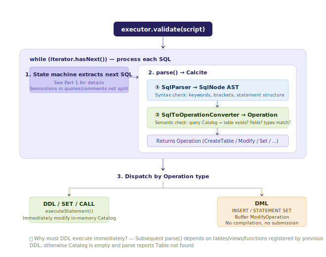

# Flink in Production: CI/CD Pipeline Like a Backend Service

## Overview

The first post solved "how to write" — one `flink run` executes a complete Multi-Statement SQL script. This one solves "how to manage": **bring Flink SQL job development to the same engineering standards as Java backend services — verifiable, traceable, rollback-able, automated.**

This post dives into the internals of **Flink SQL Validate** (Calcite parsing and validation) — the most fundamental and important component of internal real-time development workflows at major tech companies. You'll learn not just how to use it, but why it can precisely validate syntax without connecting to a Flink cluster.

Like the previous post [Flink in Production: Use Flink SQL Like Hive](./01-hive-like-flink-sql.md), this one also provides an example project [Flink SQL Bootstrap Examples - CI/CD](https://github.com/tonyabasy/flink-sql-bootstrap-examples/tree/main/example-cicd) to help you set up a local environment and walk through the CI/CD pipeline step by step.

## Why CI/CD

<p align="center"></p>
<p align="center"><em>Fig 1 · Flink SQL CI/CD vs Traditional ETL</em></p>

Introducing CI/CD for Flink SQL improves development efficiency across four dimensions:

1. Lines of code
2. Technical stack barrier
3. Maintenance cost
4. Iteration speed

This is why major tech companies use Flink SQL as the core of real-time development. CI/CD also guarantees four critical capabilities:

| Capability | Description |
|:-----------|:------------|
| **Verifiable** | Can't merge without compilation; can't deploy without passing tests — machines catch simple errors, humans focus on logic |
| **Traceable** | Who changed it, when, and why — `git log` + pipeline history form a complete chain |
| **Rollback-able** | When something breaks, no panic — redeploy the previous version, back in minutes |
| **Automated** | From commit to deployment, no human intervention for tasks machines can do |

While these capabilities are second nature for backend services, data developers typically only get them through highly integrated internal platforms at large companies. Yet these are the most fundamental and critical development workflows — their absence is a ticking time bomb: you never know when or where it'll explode.

We'll use **[flink-sql-bootstrap](https://github.com/tonyabasy/flink-sql-bootstrap) + GitLab** as a template to provide a lightweight, reliable approach: **leverage your company's existing backend CI/CD pipeline (GitLab Runner or Jenkins) to build a real-time development CI/CD pipeline for big data.**

## Quick Start

The example project handles a lot of tedious setup work — one command completes all environment installation, configuration, and even GitLab SSH setup:

```bash
cd example-cicd/docker
bash setup.sh
```

This script automatically handles 8 steps:

| Step | Description |
|:-----|:------------|
| 1. Check Docker + Docker Compose | Prerequisite validation |
| 2. Build `flink-ci-runner:1.20.4` | CI Runner image (Flink 1.20.4 + Python3 + git) |
| 3. Start GitLab CE + Runner | Two containers, bridged network |
| 4. Pre-pull Runner Helper image | Prevent CI job timeout due to network issues |
| 5. Generate/upload SSH public key | Password-free push to GitLab |
| 6. Create project repository on GitLab | API-driven, no manual steps |
| 7. Create & register Project Runner | `POST /api/v4/user/runners` |
| 8. Configure local git remote `gitlab` | `ssh://git@localhost:2224`, one-click push |

Once the environment is ready, open `http://localhost:8929` (username `root`, password `flink1234`) to see the GitLab dashboard. Edit any SQL file, push the code to trigger the pipeline:

```bash
git push gitlab main
```

## Pipeline Design

### Architecture Overview

The CI/CD pipeline in the example is divided into the following stages:

- **Rule Check**: Verify SQL code complies with data warehouse standards — naming conventions, SQL style rules
- **SQL Validation**: Leverage Flink's built-in Calcite parsing and validation to check submitted SQL:
  - Syntax check: does the SQL conform to Flink SQL syntax?
  - Semantic check: resolve Catalogs — do the referenced tables, columns, and functions exist? Are the references correct? Are the types right?
- **Dynamic Orchestration**: SQL script deployment often requires ordering — e.g., if an upstream table adds a column, you must deploy DWD before ADS. Getting the order wrong breaks the deployment.
- **Approval (not implemented)**: Real production deployments require approval workflows. The example skips this for simplicity — integrate with your internal approval system as needed.
- **Production Deployment**: Once approved, deploy SQL scripts to production (may involve restart strategies; skipped in the example for simplicity).

In the example, PR events trigger CI: if a PR is submitted and `.sql` files are changed, the CI pipeline runs. Merge events trigger CD: merging to `main` triggers the CD pipeline.

> The CD pipeline is a demonstration of the full chain. Actual CD pipelines may involve permissions, approvals, deployment order, timing, and strategies — adapt to your own situation.

<p align="center"></p>
<p align="center"><em>Fig 2 · Flink SQL CI/CD Three-Stage Pipeline</em></p>

The entire pipeline is driven by 4 scripts and 1 `.gitlab-ci.yml`.

### Pipeline Scripts

| Script | What it does | Scope |
|:-------|:-------------|:------|
| `check-warehouse-naming.sh` | Check `{layer}_{business}_{suffix}.sql` naming convention compliance | Full scan of `warehouse/` |
| `validate-sql.sh` | Flink SQL syntax + semantic validation (table existence, column existence, type matching) | Incremental (`git diff`), auto-detects changed files in CI |
| `generate-deploy-pipeline.sh` | Detect SQL changes between two commits, invoke Python orchestration script | Incremental |
| `build-deploy-order.py` | Parse layer from filenames, sort by `dwd → dws → ads`, output `child-pipeline.yml` | Called by shell script |

The core validation command is a single line — no Flink cluster needed, results in ~2 seconds:

```bash
$FLINK_HOME/bin/flink run --target local $BOOTSTRAP_JAR \
  --script-file file://<sql_file> --validate
```

Deployment is a two-step chain: `generate-deploy-pipeline.sh` detects changes → `build-deploy-order.py` sorts by layer and generates a child pipeline. The child pipeline is executed in stage order via GitLab's `trigger` + `artifact` mechanism, with `--catalog-file` injecting production table schemas.

### Pipeline Configuration

```yaml
stages:
  - validate
  - rule-check
  - deploy

warehouse-naming-check:        # Full-scan naming convention check
  stage: rule-check
  script: bash scripts/check-warehouse-naming.sh
  rules:
    - if: $CI_PIPELINE_SOURCE == "merge_request_event"
      changes: [example-cicd/warehouse/**/*.sql]
    - if: $CI_COMMIT_BRANCH == "main"
      changes: [example-cicd/warehouse/**/*.sql]

flink-sql-validate:            # Incremental syntax validation
  stage: validate
  script: bash scripts/validate-sql.sh
  rules:   # Same triggers: MR and main

generate-deploy-pipeline:      # Generate deployment child pipeline (main only)
  stage: deploy
  script: bash scripts/generate-deploy-pipeline.sh
  artifacts: [example-cicd/child-pipeline.yml]
  rules:
    - if: $CI_COMMIT_BRANCH == "main"
      changes: [example-cicd/warehouse/**/*.sql]

deploy-jobs:                   # Trigger child pipeline (main only)
  stage: deploy
  needs: [generate-deploy-pipeline]
  trigger:
    include:
      - artifact: example-cicd/child-pipeline.yml
        job: generate-deploy-pipeline
    strategy: depend
  rules:   # Same as generate-deploy-pipeline
```

Key design decisions:

- **`changes:`** ensures only SQL changes trigger the pipeline — script and documentation changes are ignored
- **MR triggers CI only** (rule check + syntax validation); **CD is only triggered on `main`**
- **`strategy: depend`** ensures that if the child pipeline fails, the parent pipeline also shows as failed

### Local Debugging

All scripts run independently without CI environment variables:

```bash
# Validate a single file
bash scripts/validate-sql.sh --file warehouse/orders/dwd_orders_di.sql

# Simulate incremental validation
CI_COMMIT_BEFORE_SHA=HEAD~2 CI_COMMIT_SHA=HEAD bash scripts/validate-sql.sh

# Manually generate deployment child pipeline
bash scripts/generate-deploy-pipeline.sh --from HEAD~2 --to HEAD
```

## Internals Deep Dive

The multi-statement SQL splitting mechanism was covered in detail in [the previous post](./01-hive-like-flink-sql.md) (Stage 1: Intelligent Tokenization) — the six-state character-by-character scanner, semicolon handling within quotes and comments — so we won't repeat it here. Let's focus on what happens after splitting.

### Full Pipeline Overview

Behind a single `flink run` command, `flink-sql-bootstrap` supports three modes in progressive order:

<p align="center"></p>
<p align="center"><em>Fig 3 · --validate → --compile → execute Three-Stage Pipeline</em></p>

- **`--validate`**: Stops after parse + DDL execution + DML staging, no compilation or submission. ~2 seconds
- **`--compile`**: Adds `planner.compilePlan()` beyond validate, outputs optimized execution plan JSON
- **Default execution**: Full pipeline — translate → injectResourceSpec → executeInternal, submits to cluster

`--validate` is the most critical stage in the CI/CD pipeline — it determines **whether code can proceed**. Let's examine its internal flow.

### `--validate` Internal Flow

<p align="center"></p>
<p align="center"><em>Fig 4 · --validate Internals: Parse Each Statement → Dispatch by Type</em></p>

After splitting, each SQL statement goes through a three-step parse pipeline — `ParserImpl.parse()`'s internal three-stage pipeline:

### ① Calcite `CalciteParser` → `SqlNode` List (Lexical + Syntax Parsing)

Flink's `CalciteParser` wraps Apache Calcite's `SqlParser`, calling `parseSqlList(statement)` to parse SQL text into one or more `SqlNode` AST nodes. This step is pure syntax parsing — no Catalog lookup.

What it checks: keyword spelling, bracket matching, SQL syntax structure validity. A typo like `SELET` — directly throws `SqlParserException` with exact line and column numbers.

A noteworthy source detail: `CalciteParser` wraps Calcite's internal `SqlParserEOFException` (EOF exception) into a more user-friendly `SqlParserException` — this is what produces the precise error messages you see in `--validate`.

### ② `SqlNodeToOperationConversion` → `Operation` (Semantic Validation + Conversion)

This is the heaviest step in the validate pipeline. Flink's `SqlNodeToOperationConversion.convert()` does two things:

**Semantic Validation**: Calls `FlinkPlannerImpl.validate(sqlNode)`, Calcite's built-in semantic validator, responsible for:

- Identifier resolution — does `orders` in `SELECT * FROM orders` exist in the Catalog?
- Column reference validation — after expanding `*`, does every column exist in the table schema?
- Type checking — is `amount` in `SUM(amount)` an aggregatable type?
- Subquery validity, JOIN condition soundness, etc.

**Type Conversion**: After validation passes, converts the legal `SqlNode` into Flink's `Operation` object. This step uses **registry-based converters** (`SqlNodeConverters`) — not hardcoded `instanceof` checks. All known converters (`SqlCreateTableConverter`, `SqlQueryConverter`, etc.) are registered at initialization, and the system matches and invokes the appropriate converter based on the `SqlNode`'s actual type. When a new SQL statement type is needed, simply register a new converter — the entire parse chain requires zero changes.

### ③ Dispatch by `Operation` Type

After parsing, the strategy is determined by the returned `Operation` type:

| Operation Type | Concrete Subclass | Strategy | Reason |
|:---------------|:------------------|:---------|:-------|
| DDL create table/view/function | `CreateTableOperation` / `CreateViewOperation` / `CreateFunctionOperation` | **Execute immediately** | Subsequent statement parsing depends on in-memory Catalog |
| Environment configuration | `SetOperation` / `ResetOperation` | **Execute immediately** | Affects compilation environment |
| DML write operations | `SinkModifyOperation` (INSERT/UPDATE/DELETE) | **Stage, no compilation** | validate doesn't need an execution plan |
| Batch DML | `StatementSetOperation` | **Stage, no compilation** | Same as above; internally wraps multiple ModifyOperations |

**Why must DDL execute immediately?** This is a critical design decision. Consider this real example:

```sql
CREATE TEMPORARY TABLE ods_orders (order_id STRING, amount DECIMAL(10,2), ...);
CREATE TEMPORARY TABLE dwd_orders (...);
INSERT INTO dwd_orders SELECT ... FROM ods_orders ...;
```

If `CREATE TABLE ods_orders` were staged like DML, when the parser processes the third `INSERT ... FROM ods_orders`, the Catalog would have no `ods_orders` table — step 2's semantic check would directly report `Table 'ods_orders' not found`.

DDL's side effects (modifying the Catalog) must be immediately visible to all subsequent statements. This is the same principle as "import before use" in programming languages.

### Three-Mode Comparison

| | `--validate` | `--compile` | Default Execution |
|:--|:--|:--|:--|
| Split + parse + DDL execution | ✅ | ✅ | ✅ |
| DML staging | ✅ | ✅ | ✅ |
| `compilePlan()` | ❌ | ✅ | ✅ |
| `translatePlan()` → submit | ❌ | ❌ | ✅ |
| **Time** | ~2s | ~5s | Depends on data volume |
| **Needs Flink cluster?** | No | No | Yes |

## Summary

This series consists of two posts, the first being [Flink in Production: Use Flink SQL Like Hive](./01-hive-like-flink-sql.md). The intention behind this series is to share, based on my own experience, an effective, reliable, low-cost Flink SQL data warehouse development workflow that improves both development efficiency and quality.

I'm genuinely passionate about coding, data engineering, and life. I welcome discussion and am happy to answer **any questions** you have. I'm also open to connecting on any topic within my areas of expertise (including but not limited to: development efficiency, AI, data engineering, history and literature, and perhaps value investing).

*Based on [Flink SQL Bootstrap](https://github.com/tonyabasy/flink-sql-bootstrap) v1.0.0 and the [example-cicd](https://github.com/tonyabasy/flink-sql-bootstrap-examples) demo*

## About the Author

🙋 Former Alibaba Data Engineer, focused on real-time engines, platforms, and applications.

👏 Feedback and discussion on real-time application development are welcome — I'll do my best to help. How to reach me:

- Submit an [Issue](https://github.com/tonyabasy/flink-sql-bootstrap/issues)
- Email: [tonyabasy@163.com](mailto:tonyabasy@163.com)

👏 Contributions to [flink-sql-bootstrap](https://github.com/tonyabasy/flink-sql-bootstrap) are welcome.
