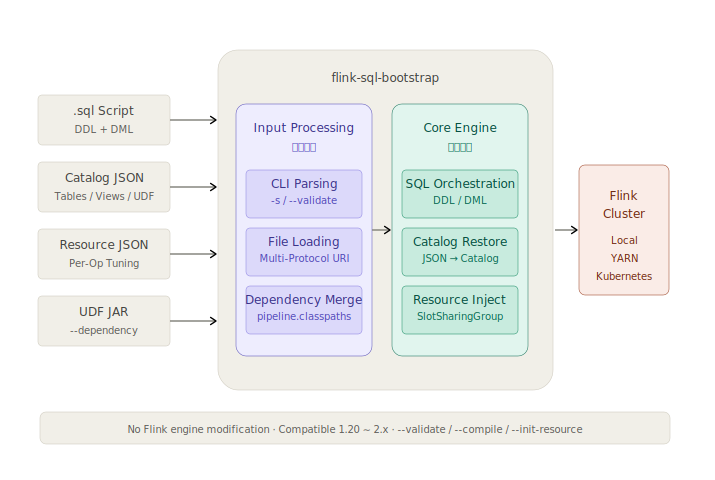

# Guide

## Quick Start

### Requirements

| Dependency | Version |
|:-----------|:--------|
| Java       | 11+     |
| Flink      | 1.20+   |

> **Preparation**: This project depends on `flink-sql-gateway-*.jar`. Before running, copy it from `$FLINK_HOME/opt` to `$FLINK_HOME/lib`:
>
> ```bash
> cp $FLINK_HOME/opt/flink-sql-gateway-*.jar $FLINK_HOME/lib
> ```

### Download

Download the latest JAR from [GitHub Releases](https://github.com/tonyabasy/flink-sql-bootstrap/releases).

### Run a SQL Script

The simplest way — submit a SQL script containing both DDL and DML:

```bash
$FLINK_HOME/bin/flink run \
    --target local \
    flink-sql-bootstrap-${version}.jar \
    --script-file classpath:example-word-count.sql
```

Where `example-word-count.sql` contains a self-contained Word Count:

```sql
CREATE TEMPORARY TABLE source_table (
  sentence STRING
) WITH (
  'connector' = 'datagen',
  'rows-per-second' = '1'
);

CREATE TEMPORARY TABLE sink_table (
  word STRING,
  cnt BIGINT
) WITH (
  'connector' = 'print'
);

INSERT INTO sink_table
SELECT word, COUNT(*) AS cnt
FROM source_table
CROSS JOIN UNNEST(SPLIT(sentence, ' ')) AS t(word)
GROUP BY word;
```

Expected output (values vary since datagen generates random data):

```
+I[<random_hex_string>, 1]
+I[<random_hex_string>, 1]
+I[<random_hex_string>, 1]
```


## Core Features

### Multi-Statement SQL Script

Write DDL, DML, `SET`, and `CALL` statements in a single `.sql` file — the launcher splits, validates, and orchestrates execution automatically:

- **DDL executes immediately** during script splitting, since subsequent statements may depend on catalog state.
- **DML is delayed** — parsed, compiled, and translated as a batch, so resource specs can be injected into the DAG before submission.
- Supports loading scripts from `classpath:`, `file://`, `http(s)://`, `hdfs://`, or `s3://`.

### Catalog Snapshots

Pre-register tables, views, and UDFs via a JSON snapshot so your SQL script contains **zero DDL** — only pure DML:

```bash
$FLINK_HOME/bin/flink run \
    --target local \
    flink-sql-bootstrap-${version}.jar \
    --script-file classpath:example-word-count-advanced.sql \
    --catalog-file classpath:example-catalog.json \
    --resource-file classpath:example-resource.json \
    --dependency classpath:example-udf-reverse.jar \
    --dependency classpath:example-udf-substring.jar
```

Tables and UDFs are pre-registered at job startup. The SQL script becomes clean DML:

```sql
INSERT INTO dws_word_count
SELECT my_reverse(my_substring(word, 0, 2)) AS word, COUNT(*) AS cnt
FROM ods_words
CROSS JOIN UNNEST(SPLIT(sentence, ' ')) AS t(word)
GROUP BY my_reverse(my_substring(word, 0, 2));
```

### Fine-Grained Resource Tuning

Generate a resource template from your SQL script:

```bash
$FLINK_HOME/bin/flink run ... --script-file job.sql --init-resource
```

This outputs a JSON template with per-operator UIDs. Tune CPU, heap memory, managed memory, parallelism, and chain strategy per operator, then inject before submission:

```bash
$FLINK_HOME/bin/flink run ... --script-file job.sql --resource-file resource.json
```

Resources are injected via **SlotSharingGroup**. Operators with identical resource configs are automatically grouped into the same SlotSharingGroup, preserving operator chains.

> **Note**: When the SQL DAG changes (e.g., modifying `GROUP BY`, adding new tables, adjusting JOINs), the operator UID structure may shift, invalidating the existing resource config file. Re-generate it via `--init-resource`.


## Execution Modes

Besides full execution, three dry-run modes are available for CI/CD and development:

| Mode | Flag | Description |
|:-----|:-----|:------------|
| **Normal** | *(default)* | Full execution: parse → compile → inject → submit |
| **Validate** | `--validate` | Parse and validate SQL syntax without submitting to a cluster. Errors include line and column numbers. |
| **Compile** | `--compile` | Parse, validate, and compile. Outputs the `InternalPlan` as JSON for inspection. |
| **Init Resource** | `--init-resource` | Extract the DAG structure from SQL and output a resource configuration template. |

```bash
# Validate SQL
$FLINK_HOME/bin/flink run ... --script-file job.sql --validate

# Compile and inspect the plan
$FLINK_HOME/bin/flink run ... --script-file job.sql --compile

# Generate resource template
$FLINK_HOME/bin/flink run ... --script-file job.sql --init-resource
```


## Configuration Reference

### CLI Options

Use `-h` / `--help` to see all options at runtime. For each resource type, `--xxx` and `--xxx-file` are mutually exclusive — the former accepts a direct value or local path, the latter accepts a URI (supports `file://`, `http(s)://`, `hdfs://`, `s3://`).

| Short | Long | Description |
|:------|:-----|:------------|
| `-h` | `--help` | Print help and exit. |
| `-s` | `--script` | SQL script content as a direct string. |
| `-sf` | `--script-file` | SQL script file URI (required if `--script` not set). |
| `-c` | `--catalog` | Catalog snapshot JSON as a direct string. |
| `-cf` | `--catalog-file` | Catalog snapshot file URI. |
| `-r` | `--resource` | Resource configuration JSON as a direct string. |
| `-rf` | `--resource-file` | Resource configuration file URI. |
| `-d` | `--dependency` | Local path to UDF JAR. Repeatable. |
| | `--validate` | Parse and validate SQL syntax, do not submit. |
| | `--compile` | Parse, validate, and compile. Output execution plan as JSON. |
| | `--init-resource` | Generate an initial resource configuration template from the SQL script for first-time fine-grained resource tuning. |

### Resource Hint JSON

Describes per-operator resource configuration. Each operator is matched by `uid` (preferred) or `name`.

> **Limitations**:
> - You must configure resources for all operators or none at all — partial configuration will cause job startup failure due to unmatched operators.
> - Re-generate the config via `--init-resource` when the SQL DAG structure changes.

**Built-in Profile Presets:**

| Profile | CPU | Heap | Managed | Use Case |
|:--------|:----|:-----|:--------|:---------|
| `stateless` | 0.5 | 512 MB | — | filter, map, simple transform |
| `stateful` | 1.0 | 2 GB | 256 MB | window, deduplicate |
| `join_heavy` | 1.0 | 4 GB | 512 MB | interval join, lookup join |
| `sink` | 0.5 | 1 GB | — | jdbc sink, file sink |

When `profile` is set, explicit `cpu`/`heap`/`managed`/`offHeap` values are ignored.

```json
{
  "version": 1,
  "defaultParallelism": 2,
  "operators": [
    {
      "uid": "1_source",
      "name": "ods_words[1]",
      "parallelism": 1,
      "chainStrategy": "HEAD",
      "resource": { "profile": "stateless" }
    },
    {
      "uid": "5_group-aggregate",
      "name": "GroupAggregate[5]",
      "parallelism": 4,
      "chainStrategy": "ALWAYS",
      "resource": {
        "cpu": 1.0,
        "heap": "2048m",
        "managed": "256m"
      }
    }
  ]
}
```

| Field | Type | Description |
|:------|:-----|:------------|
| `version` | int | Schema version, currently `1`. |
| `defaultParallelism` | int | Global default. `0` means no override. Priority: operator > this > Flink config. |
| `operators` | array | Operator configurations. Must cover every PhysicalTransformation. |
| `operators[].uid` | string | Stable UID for exact matching (preferred). |
| `operators[].name` | string | Operator name for fallback matching. |
| `operators[].parallelism` | int | Parallelism. `-1` falls through to defaultParallelism or Flink default. |
| `operators[].chainStrategy` | string | `HEAD`, `ALWAYS`, or `NEVER`. `null` means no change. |
| `operators[].resource.profile` | string | Preset profile. When set, explicit CPU/memory values are ignored. See table above. |
| `operators[].resource.cpu` | double | CPU cores (fractional allowed). Only takes effect when profile is empty. |
| `operators[].resource.heap` | string | Task heap memory, e.g. `"512 MB"`, `"2g"`. |
| `operators[].resource.managed` | string | Managed memory, e.g. `"256m"`. |
| `operators[].resource.offHeap` | string | Off-heap memory, e.g. `"128m"` (optional). |
| `operators[].resource.external` | map | External resources, e.g. `{"gpu": 1.0}` (optional). |

### Catalog Snapshot JSON

Describes a self-contained catalog with tables, views, and UDFs.

```json
{
  "version": 1,
  "snapshotId": "example-word-count",
  "catalogName": "platform",
  "databaseName": "default",
  "tables": [
    {
      "database": "default",
      "name": "ods_words",
      "columns": [
        { "name": "sentence", "type": "STRING", "nullable": true },
        { "name": "ts", "type": "TIMESTAMP_LTZ(3)", "nullable": false,
          "isComputed": true, "computedExpr": "PROCTIME()" }
      ],
      "primaryKey": { "columnNames": ["id"], "enforced": true },
      "watermark": { "rowtimeColumn": "ts", "expression": "ts - INTERVAL '5' SECOND" },
      "partitionKeys": [],
      "options": {
        "connector": "datagen",
        "rows-per-second": "1"
      }
    }
  ],
  "views": [
    {
      "database": "default",
      "name": "v_latest_words",
      "expandedQuery": "SELECT sentence FROM ods_words WHERE ts > CURRENT_TIMESTAMP - INTERVAL '10' MINUTE"
    }
  ],
  "udfs": [
    {
      "database": "default",
      "name": "my_reverse",
      "kind": "SCALAR",
      "className": "examples.udf.MyReverseFunction",
      "functionLanguage": "JAVA",
      "jarRef": "example-udf-reverse.jar"
    }
  ]
}
```

> **Note**: The UDF `jarRef` is for lineage tracking only. UDF JARs are loaded via `--dependency` or `pipeline.classpaths` — they are **not** loaded based on this field.

| Field | Type | Description |
|:------|:-----|:------------|
| `version` | int | Schema version, currently `1`. |
| `snapshotId` | string | Unique identifier for this snapshot. |
| `catalogName` | string | Flink catalog name. |
| `databaseName` | string | Default database name. |

**tables[].columns[] — Column definitions:**

| Field | Type | Description |
|:------|:-----|:------------|
| `name` | string | Column name. |
| `type` | string | Flink SQL type string, e.g. `"BIGINT"`, `"TIMESTAMP_LTZ(3)"`. |
| `nullable` | bool | Whether the column is nullable. |
| `isComputed` | bool | Whether this is a computed column (e.g. `PROCTIME()`). |
| `computedExpr` | string | Computed column expression. Omit if not computed. |
| `isMetadata` | bool | Whether this is a metadata column. |
| `metadataKey` | string | Metadata column key. Can be empty for plain metadata columns. |
| `virtual` | bool | Whether a metadata column is declared VIRTUAL. |
| `comment` | string | Column comment (optional). |

**tables[] — Table definitions:**

| Field | Type | Description |
|:------|:-----|:------------|
| `database` | string | Owning database name. |
| `name` | string | Table name. |
| `columns` | array | Column definitions (see above). |
| `primaryKey` | object | Primary key: `constraintName`(string), `columnNames`(array), `enforced`(bool). |
| `watermark` | object | Watermark: `rowtimeColumn`(string), `expression`(string). |
| `partitionKeys` | array | Partition key column names. |
| `comment` | string | Table comment (optional). |
| `options` | map | Connector options (e.g. `connector`, `rows-per-second`). |

**views[] — View definitions:**

| Field | Type | Description |
|:------|:-----|:------------|
| `database` | string | Owning database name. |
| `name` | string | View name. |
| `expandedQuery` | string | Expanded SQL query. Note: the field name is `expandedQuery`. |
| `comment` | string | View comment (optional). |

**udfs[] — UDF definitions:**

| Field | Type | Description |
|:------|:-----|:------------|
| `database` | string | Owning database name. Falls back to root `databaseName` when null. |
| `name` | string | Function name. |
| `kind` | string | `SCALAR`, `TABLE`, or `AGGREGATE`. |
| `className` | string | Fully-qualified class name. |
| `functionLanguage` | string | `JAVA` or `PYTHON`. |
| `jarRef` | string | JAR file name reference — **for lineage tracking only, not for loading**. |
| `description` | string | Function description (optional). |
| `typeInference` | map | Optional type inference hints. Null means Flink infers via reflection. |


## Architecture

Flink SQL Bootstrap operates as a thin orchestration layer on top of Flink's official APIs. It does **not** modify the Flink engine, Planner, or SQL semantics.



The diagram above illustrates the overall processing pipeline: external inputs (SQL script, Catalog snapshot, resource config, UDF JARs) enter the system and flow through two stages — **Input Processing** (CLI parsing, file reading, dependency merging) and **Core Engine** (SQL orchestration, Catalog restoration, resource injection) — before being submitted to a Flink cluster via `executeInternal()`.

### Key Design Considerations

**Built on Flink's SQL Gateway module — semantic compatibility is guaranteed.** The project directly reuses `SessionContext`, `OperationExecutor`, and `Planner` from `flink-sql-gateway-*.jar`, ensuring the standard `parse → validate → compile` pipeline is identical to Flink's official implementation. All SQL semantics are maintained by the Flink community; this project introduces no dialects or semantic modifications.

**Resource injection leverages the DataStream Fine-Grained Resource mechanism.** Per-operator CPU, memory, and parallelism are injected through `SlotSharingGroup`, utilizing Flink DataStream API's `Transformation.setSlotSharingGroup()`. Operators with identical resource configs are automatically grouped into the same SlotSharingGroup, preserving operator chains.

**Catalog snapshots are intentional — not real-time connections.** A Flink job's startup and restart should not produce unpredictable behavior due to upstream metadata changes. Snapshots freeze tables, views, and UDFs into a JSON file, guaranteeing a constant Catalog state for every job launch. Restart behavior is fully deterministic. When a Catalog update is required, regenerate the snapshot explicitly.

## Capability Boundaries

**What it is:**
- A production-grade Flink SQL Application Template
- A bridge connecting Flink SQL scripts with external metadata and fine-grained resource control

**What it is not:**
- **Not** a Flink SQL Gateway — follows the `flink run` job submission paradigm
- **Not** a utility library — it is an Application with a `main()` method, not a dependency you import

**Boundaries:**
- Zero modifications to the Flink engine, Planner, or SQL semantics
- No custom SQL dialects — results are identical to native Flink SQL
- User Flink configurations are passed through as-is

## Compatibility

Verified via the [compatibility test suite](https://tonyabasy.github.io/flink-sql-bootstrap/flink-compat-test-1.0.1.html) on Local, YARN, and Kubernetes.

| Flink Version | Local | YARN-App | YARN-Session | K8s-Session | K8s-App |
|:--------------|:-----:|:--------:|:------------:|:-----------:|:-------:|
| 1.20.4 | ✅ | ✅ | ✅ | ✅ | ✅ |
| 2.0.2 | ✅ | ✅ | ✅ | ✅ | ✅ |
| 2.1.1 | ✅ | ✅ | ✅ | ✅ | ✅ |
| 2.2.0 | ✅ | ✅ | ✅ | ✅ | ✅ |

✅ PASS · ❌ FAIL · — Not tested
