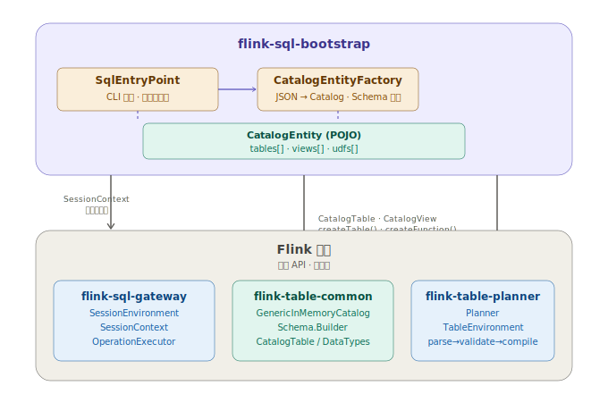

# Flink 实时数仓开发实战：Catalog 快照，让 DDL 只写一次

## 概览

前两篇文章我们解决了两件事：**怎么跑**（[像 Hive 那样用 Flink SQL](01-hive-like-flink-sql.md)），**怎么管**（[像后端那样 CI/CD](02-cicd-pipeline.md)）。

传统的 Flink SQL DDL 散落在每个 SQL 脚本里。一个实时数仓有几十张表，每张表的 `CREATE TABLE` 出现在引用它的每个脚本中。改一个字段类型所有脚本全要改。这也是为什么需要一个 **Flink SQL 元数据中心**。

本文介绍的 **Catalog 快照**解决的就是这个问题：把 DDL 从 SQL 脚本中剥离，序列化为一个自包含的 JSON 文件，作业启动时自动恢复到内存 Catalog。实现 **DDL 写一次，所有作业共用**。

本文将深入 Catalog 快照的设计思路和底层原理 —— **为什么必须是"快照？"、如何在 Flink 现有 API 基础上实现 DDL 语义的完全兼容？**。本文基于 [flink-sql-bootstrap](https://github.com/tonyabasy/flink-sql-bootstrap) 搭建，如果你不想直接用该项目，文中也介绍了内部原理能够指引你如何自建。

## 为什么是"快照"？

先看快照长什么样。这是一个最简版本——只定义两张表，两个 UDF：

```json
{
  "version": 1,
  "snapshotId": "20240622-155500-a1b2",
  "catalogName": "platform",
  "databaseName": "default",
  "tables": [
    {
      "database": "default",
      "name": "ods_words",
      "columns": [
        { "name": "sentence", "type": "STRING", "nullable": true }
      ],
      "options": {
        "connector": "datagen",
        "rows-per-second": "1"
      }
    },
    {
      "database": "default",
      "name": "dws_word_count",
      "columns": [
        { "name": "word", "type": "STRING", "nullable": false },
        { "name": "cnt", "type": "BIGINT", "nullable": false }
      ],
      "options": {
        "connector": "print"
      }
    }
  ],
  "views": [],
  "udfs": [
    {
      "name": "my_reverse",
      "className": "examples.udf.MyReverseFunction",
      "functionLanguage": "JAVA",
      "jarRef": "example-udf-reverse.jar"
    },
    {
      "name": "my_substring",
      "className": "examples.udf.MySubstringFunction",
      "functionLanguage": "JAVA",
      "jarRef": "example-udf-substring.jar"
    }
  ]
}
```

配合这份快照，SQL 脚本里**不再需要任何 DDL**：

```sql
INSERT INTO dws_word_count
SELECT my_reverse(my_substring(word, 0, 2)) AS word, COUNT(*) AS cnt
FROM ods_words
CROSS JOIN UNNEST(SPLIT(sentence, ' ')) AS t(word)
GROUP BY my_reverse(my_substring(word, 0, 2));
```

可以看到，表和 UDF 全部来自 Catalog 快照，SQL 脚本里**没有任何 DDL**，只剩业务逻辑。

那为什么不直接用 Flink 自带的 Catalog？Flink 提供了一些内置的 Catalog，但是它们都有一定的劣势： 
- `GenericInMemoryCatalog` 是纯内存版本，进程重启就消失；
- `HiveCatalog` 可以持久化到 Hive Metastore，但需要额外部署 HMS 服务；
- `JDBCCatalog` 同理。这些 Catalog 启动时都要连到某个"活的"元数据中心，拿到的永远是**最新的** DDL。

**Catalog 快照设计的初衷是启停幂等性**。想象一种场景：你的 Flink 作业已经跑了三周，因为集群维护需要重启。但就在这三周里，上游业务改了 ODS 表的字段类型。如果你重启时去一个"活的"元数据中心拉取最新 DDL，拿到的是新 Schema——和 Checkpoint 里保存的状态对不上，轻则启动失败，重则静默恢复后产出错误数据。

Catalog 快照解决的就是这个问题：**把部署时刻的 DDL 冻结为一个不可变的 JSON 文件**。部署时什么样，重启后还是什么样。这也是为什么这份 JSON 应该和 SQL 脚本一起进 Git——部署时刻的完整元数据状态被永远锁定。

> flink-sql-bootstrap 项目中**快照的"不变性"是约定，不是代码强制的，仅在 `Catalog` 定义中定义了 `snapshotId`**。flink-sql-bootstrap 负责把 DDL 从 SQL 脚本中剥离，你负责让这份 DDL 在部署周期内不变——URL 锁死版本号、和脚本一起进 Git 即可。比如说你搭建了一个 REST 服务，那么资源定义则为 `https://catalog-server/snapshot/{snapshot-id}`。

## 快速开始

接下来我们将基于 [flink-sql-bootstrap](https://github.com/tonyabasy/flink-sql-bootstrap) 项目及内置的示例带你体验一下 Catalog 快照的乐趣。

你需要从 [GitHub Releases](https://github.com/tonyabasy/flink-sql-bootstrap/releases) 下载 JAR，确保 `${FLINK_HOME}/lib` 下有 `flink-sql-gateway-*.jar`（从 `${FLINK_HOME}/opt` 拷贝即可）。

一个完整的带 Catalog 快照的部署命令：

```bash
$FLINK_HOME/bin/flink run \
    --target local \
    flink-sql-bootstrap-${version}.jar \
    --script-file classpath:example-word-count-advanced.sql \
    --catalog-file classpath:example-catalog.json \
    --dependency classpath:example-udf-reverse.jar \
    --dependency classpath:example-udf-substring.jar
```

其中 `example-catalog.json` 就是上文展示的快照，`example-word-count-advanced.sql` 的内容就是上文那个只含 DML 的脚本：

```sql
INSERT INTO dws_word_count
SELECT my_reverse(my_substring(word, 0, 2)) AS word, COUNT(*) AS cnt
FROM ods_words
CROSS JOIN UNNEST(SPLIT(sentence, ' ')) AS t(word)
GROUP BY my_reverse(my_substring(word, 0, 2));
```

JAR 内已内置这些示例文件，无需额外准备。

`--catalog-file` 和 `--script-file` 一样支持五种协议：`classpath:`、`file://`、`http(s)://`、`hdfs://`、`s3://`。`--dependency` 用于加载 UDF 的 JAR 包。

执行后输出：

```
+I[6a, 1]
+I[00, 1]
+I[a3, 1]
+I[8f, 1]
```

UDF `my_reverse` 和 `my_substring` 的组合效果是：取每个单词前两个字符再反转。整个过程中 SQL 脚本没有写任何 `CREATE TABLE` 或 `CREATE FUNCTION`，所有 DDL 来自 Catalog 快照。

## Flink SQL Bootstrap 是如何做到的？

在讲 flink-sql-bootstrap 怎么做之前，先简单说下 Flink 的 Catalog 是什么。

Flink SQL 解析 `SELECT * FROM orders` 时 `orders` 这张表从哪来？答案是 **Catalog**，Flink 的元数据注册中心。它存储了当前 Session 中所有可用的表结构、视图定义和 UDF。你在 SQL Client 里 `CREATE TABLE`，本质上就是往当前 Catalog 里注册了一条元数据。

Catalog 的核心 API 就几个，比如：`createDatabase()`、`createTable()`、`createFunction()`。flink-sql-bootstrap 做的事也很直接：**把 JSON 快照翻译成这些元信息然后调用 `createXXX()` API 构建 Catalog**。整体架构如下图所示。



`CatalogEntity` 是"数据"，`GenericInMemoryCatalog` 是"仓库"，`SessionEnvironment` 把仓库挂到 SQL 引擎上。恢复过程就是 `CatalogEntityFactory` 把数据从实体搬进仓库的过程，分五步，核心是第三步（注册表）：

1. `new GenericInMemoryCatalog(name, db)` —— 创建一个空的内存 Catalog
2. `createDatabase(db, ...)` —— 确保默认数据库存在
3. 遍历 `tables`，每条 `TableEntity` 转成 `CatalogTable`，调 `createTable()`
4. 遍历 `views`，每条 `ViewEntity` 转成 `CatalogView`，调 `createTable()`
5. 遍历 `udfs`，每条 `UdfEntity` 转成 `CatalogFunctionImpl`，调 `createFunction()`

### 剩下的事情：注册、挂载、执行

注册完的 Catalog 只是数据，还需要挂到 SQL 引擎上。在 `SqlEntryPoint` 中，完整链路如下：

**第一步：将 Catalog 注册到 `SessionEnvironment`。**

```java
SessionEnvironment.Builder builder = SessionEnvironment.newBuilder()
        .setSessionEndpointVersion(SqlGatewayRestAPIVersion.getDefaultVersion());
if (catalogJson != null) {
    // CatalogEntityFactory 将 JSON 反序列化为 CatalogEntity，再逐表/逐 UDF 注册到 GenericInMemoryCatalog
    GenericInMemoryCatalog catalog = CatalogEntityFactory.from(catalogJson);
    // 注册并设为默认 Catalog
    builder.registerCatalog(catalog.getName(), catalog)
            .setDefaultCatalog(catalog.getName());
}
SessionEnvironment ssEnv = builder.build();
```

`SessionEnvironment` 是 Flink SQL Gateway 的会话环境抽象，管理当前 Session 下挂载的所有 Catalog。这里如果有快照就注册快照生成的 Catalog，如果没有就用 SQL 脚本内的 DDL 自行建表。

**第二步：构建 `SessionContext`。**

```java
SessionHandle sessionHandle = new SessionHandle(UUID.randomUUID());
SessionContext sessionContext = UriSafeSessionContext.create(
        defaultContext, dependencies, sessionHandle, ssEnv, Executors.newDirectExecutorService());
```

`SessionContext` 是 Flink SQL Gateway 的会话上下文，它将 `SessionEnvironment`（Catalog）、`DefaultContext`（Flink 配置）和 UDF JARs 的 `ClassLoader` 绑定到一起。到这里 SQL 引擎就有了完整的元数据和执行环境。

**第三步：委托 `StreamingScriptExecutor` 执行。**

```java
StreamingScriptExecutor executor = new StreamingScriptExecutor(
        sessionContext, sqlScript, resourceConfig, new Printer(System.out));
executor.execute();  // 切分 SQL → DDL 立即执行 → DML 编译 → 提交
```

`StreamingScriptExecutor` 是参考平台的 `ScriptExecutor`（Flink 2.x) 在 Flink SQL Bootstrap 中自实现的，它是**核心中的核心**，重建的初衷是为了支持一些企业级特性：

- SQL 验证、编译
- 血缘分析、构建
- SQL StreamGraph 细粒度资源注入
- Flink 1.x 兼容等

`StreamingScriptExecutor` 拿到 `SessionContext` 后，通过 `OperationExecutor` 解析 SQL 时就能在 Catalog 中查表、查 UDF。比如 `SELECT * FROM ods_words`，`ods_words` 已经在第一步注入的 Catalog 中了——没有 DDL，SQL 引擎也能正常工作。

## 自建指南

如果你想自己实现同样的能力，核心就两件事：

**1. JSON → Catalog 恢复。** 定义自己的实体模型，遍历表/视图/UDF，逐一调用 `GenericInMemoryCatalog` 的 `createTable()` / `createFunction()` 等 API。重点是 Schema 构建顺序（物理列 → 元数据列 → 计算列 → Watermark → 主键）必须与 Flink 内部一致，类型字符串直接委托 `DataTypes.of(String)` 解析。

**2. Catalog → SessionEnvironment → SessionContext。** 这套链路是 Flink SQL Gateway 的标准入口，直接复用 `SessionEnvironment.Builder` 和 `UriSafeSessionContext`（或自行处理 1.20.x 兼容性），无需自建。

> 参考源码：[CatalogEntityFactory.java](https://github.com/tonyabasy/flink-sql-bootstrap/blob/main/src/main/java/com/lanting/flink/sql/bootstrap/catalog/CatalogEntityFactory.java)、[SqlEntryPoint.java](https://github.com/tonyabasy/flink-sql-bootstrap/blob/main/src/main/java/com/lanting/flink/sql/bootstrap/SqlEntryPoint.java)、[StreamingScriptExecutor.java](https://github.com/tonyabasy/flink-sql-bootstrap/blob/main/src/main/java/com/lanting/flink/sql/bootstrap/executor/StreamingScriptExecutor.java)

## 小结

本文的核心是 **把 DDL 从 SQL 脚本中剥离，冻结为一个不可变的 JSON 快照。并做到表结构、视图、UDF——DDL 写一次，所有作业共用。** 快照和 SQL 脚本可以一起进 Git，部署时刻的完整元数据状态被永远锁定，作业重启不再依赖"活的"元数据中心，彻底消除因 Schema 漂移导致的恢复失败。

*本文基于 [Flink SQL Bootstrap](https://github.com/tonyabasy/flink-sql-bootstrap) 及内置示例*

## 关于作者

🙋 前阿里巴巴数据研发工程师，专注实时引擎、实时平台、实时应用开发。

👏 欢迎反馈和交流实时应用开发中的任何问题，我将尽我所能帮助大家。如何联系我：

- 项目中提交 [Issue](https://github.com/tonyabasy/flink-sql-bootstrap/issues)
- Email：[tonyabasy@163.com](mailto:tonyabasy@163.com)

👏 同时欢迎大家参与 [flink-sql-bootstrap](https://github.com/tonyabasy/flink-sql-bootstrap) 共建。