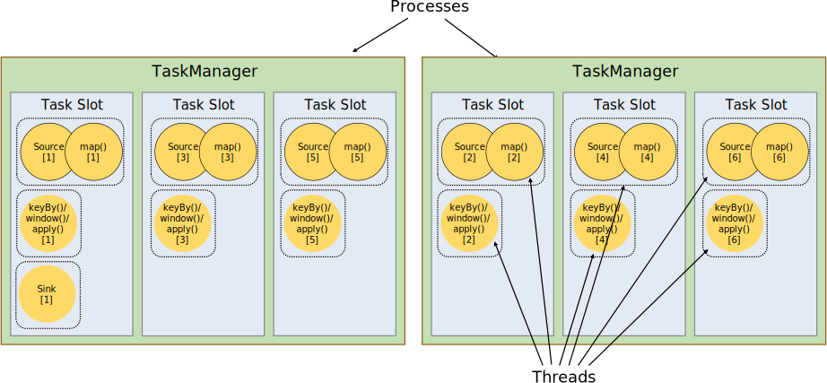

# Flink 实时数仓开发实战：SQL中也能做到资源精细化管理

## 概览

前三篇解决了**怎么跑、怎么管、DDL 怎么复用**。这篇解决第四件事：**怎么省**。

Flink 1.6 提供了[细粒度资源配置](https://nightlies.apache.org/flink/flink-docs-release-2.2/docs/deployment/finegrained_resource/)的能力。该能力大大提升了大任务、大并发作业下资源利用率。但是直至 2.x 版本该能力只支持 DataStream，Flink SQL 无法享受到细粒度资源配置带来的福利。

本文深入浅出地带你彻底搞清楚 Flink 资源配置的底层原理，收益是什么，如何做到。以下是核心内容：

- 什么是细粒度资源配置，它们到底如何运作的，带来的收益到底是什么？
- 哪些作业适合细粒度配置？哪些作业普通的粗粒度资源配置就足够了？
- 基于 Flink SQL Bootstrap 项目 Flink SQL 中如何使用这一特性？
- 如果我希望自己搭建我应该从哪里开始做？

## Flink 资源配置原理

### 基本概念

为了更好的理解接下来的内容，我们用较短的篇幅回顾一下核心概念。更详细的可以参考 [Flink 架构](https://nightlies.apache.org/flink/flink-docs-release-2.2/docs/concepts/flink-architecture/) 和 [细粒度资源配置](https://nightlies.apache.org/flink/flink-docs-release-2.2/docs/deployment/finegrained_resource/)。

简单来讲，Flink 资源配置的过程就是在 `flink run` 运行后分析用户所需资源并向对应的资源管理器（YARN、Kubernetes、Local）申请启动的过程。下图是官网的经典图，它详细描述了我们的代码是如何运行在 Flink Cluster 中的。



- **TaskManager（绿色框）**：Flink 集群的工作节点，实际上是一个 JVM 进程。一台机器上可以跑多个 TM，负责真正执行任务。
- **Slot（蓝色框）**：TM 内部的最小资源容器。一个 TM 可以切分成多个 Slot，每个 Slot 占 TM 的一部分 CPU 和内存。**Slot 是 Flink 资源调度、任务运行的最小单元**。
- **Task（虚线框）**：一个算子（Operator）的并行实例。比如 Source 并行度是 64，就有 64 个 Task，每个 Task 跑在一个 Slot 里。
- **Operator Chain（黄色框）**：Flink 的优化机制——把能串联的算子（没有 shuffle 依赖）合并成一个 Task，减少线程切换和网络开销。

### 资源配置流程

当作业启动后，Flink 会构建算子链（Operator Chain）和 Task，并进行资源配置。资源配置分为 2 个阶段：

1. **Phase 1**：Task 找到合适的 Slot
2. **Phase 2**：Slot 找到合适的 TaskManager，如果没有则去找 YARN/Kubernetes 申请，然后再匹配

下图展示了 **粗粒度资源配置（Coarse-Grained Resource Manager）** 和 **细粒度资源配置（Fine-Grained Resource Manager）** 的详细过程。我们的核心假设是：

- 有三个算子链（`A[Source & Filter] -> B[WindowAgg] -> C[Sink]`）
    - A：并行度=64，Cpu=0.5C，内存=1GB
    - B：并行度=4，Cpu=2C，内存=4GB（聚合需要的资源大一些）
    - C：并行度=4，Cpu=0.5C，内存=1GB
- 粗粒度资源配置：单 TM Slots 数量是 4
- 细粒度资源配置：单 TM 的资源量是 12C + 24GB
- 细粒度下我们配置了 3 个 SlotSharingGroup：`SSG-A、SSG-B、SSG-C`



**粗粒度资源配置（Coarse-Grained Resource Manager）** 过程中，SlotSharingGroup 用户不可以指定，使用默认的 SSG（Default SSG）。**SSG 名称是否相同是决定算子是否共用同一个 Slot 的关键。** 因此，粗粒度下 A、B、C 算子共用同一个 Slot，所有的 Slot 规格相同，并且 Slot 的数量总是等于最大并行度：**64 个**。

- Phase 1：首先将各个 Task 规划到不同的 Slots 中，默认的负载均衡策略下根据 **Subtask 的 ID 分配到对应 ID 的 Slots 中**
    - A-subtask-0 -> slot-0、A-subtask-1 -> slot-1 ... A-subtask-63 -> slot-63
    - B-subtask-0 -> slot-0 ...B-subtask-3 -> slot-3
    - C-subtask-0 -> slot-0 ... C-subtask-3 -> slot-3
- Phase 2：接下来需要将 Slots 分配到各个 TM 中，默认的负载均衡策略下会按照 **Slots 的顺序依次装箱：4 个 Slots 一箱**

**细粒度资源配置（Fine-Grained Resource Manager）**的不同在于 **Slot 的资源量不同**，细粒度的 SlotSharingGroup 是用户指定的 `SSG-A、SSG-B、SSG-C`。因此也不需要为 Task 规划 Slots（Phase 1）。**Slot 均衡**策略下，按照 TM **当前剩余资源分配**：剩余资源多的 TM 优先被当前 Slots 占用，剩余资源少的最后分配。最终 TM 内会**均匀的分布相同数量**的 SSG-A、SSG-B、SSG-C，如同右侧的 Task Manager 视图所示。

经过对比，两者的资源利用率差距巨大：

- 粗粒度：使用了 16 个 TM，资源利用率 23.8%
- 细粒度：使用了 4 个 TM，资源利用率 87.5%

### 细粒度资源配置适用场景

细粒度资源配置并不是所有场景均适用的，当你的算子并行度基本相同，各个 Task 消耗的资源差不多时粗粒度是非常好用的。除非你的任务满足以下条件之一或全部：

- 算子间的并发度差距较大：这种情况下注定大部分 Slots 只跑一部分的算子，因此会带来资源的浪费
- 算子间的资源差距较大：TM 需要根据最大资源来申请，这种情况下注定有些 Slots 的资源被浪费

## Flink SQL 中使用细粒度资源配置

Flink SQL 中包含了大量的 ETL、聚合，并发度也参差不齐，比如：

- 上游数据量巨大，需要过滤出少量数据出来然后做一些分析：Source、Filter 算子并发度巨大，分析聚合算子并发度较小、Sink 算子并发度也比较小
- 长时间窗口的数据关联或者聚合：WindowAgg、Join 算子需要很大的内存，但是 Source、Sink 小资源即可
- 部分算子需要额外用到 GPU 资源，但是 GPU 资源宝贵不能给 Source、Sink 使用：Calc 算子中的 UDF 可借助 GPU 对图片进行处理，Source、Sink 不需要 GPU

以上 3 种常见的场景绝对是细粒度的用武之地。但是当前 Flink 官方的细粒度资源配置 **仅支持 DataStream，不支持 SQL**，导致了大量的 Flink SQL 作业资源利用率不高。使用 DataStream 开发成本、迭代成本又比较高。

[flink-sql-bootstrap](https://github.com/tonyabasy/flink-sql-bootstrap) 就是为了解决这个问题：**把细粒度资源配置能力原封不动地带给 Flink SQL**。你只需一个 JSON 文件描述各算子的资源需求，提交时注入即可。

### 快速开始

从 [GitHub Releases](https://github.com/tonyabasy/flink-sql-bootstrap/releases) 下载 JAR，确保 `${FLINK_HOME}/lib` 下有 `flink-sql-gateway-*.jar`。

#### Step 1 — 生成资源模板

`--init-resource` 会根据 SQL 脚本自动分析出所有算子，生成资源模板：

```bash
$FLINK_HOME/bin/flink run \
    --target local \
    flink-sql-bootstrap-${version}.jar \
    --script-file classpath:example-word-count.sql \
    --init-resource
```

输出：

```json
{
  "version" : 1,
  "operators" : [ {
    "uid" : "1_source",
    "name" : "source_table[1]",
    "parallelism" : 1,
    "chainStrategy" : "HEAD"
  }, {
    "uid" : "2_correlate",
    "name" : "Correlate[2]",
    "parallelism" : 1,
    "chainStrategy" : "ALWAYS"
  }, {
    "uid" : "3_calc",
    "name" : "Calc[3]",
    "parallelism" : 1,
    "chainStrategy" : "ALWAYS"
  }, {
    "uid" : "5_group-aggregate",
    "name" : "GroupAggregate[5]",
    "parallelism" : -1,
    "chainStrategy" : "ALWAYS"
  }, {
    "uid" : "6_sink",
    "name" : "sink_table[6]",
    "parallelism" : -1,
    "chainStrategy" : "ALWAYS"
  } ]
}
```

模板列出了每个算子的 `uid`、`name`、当前并行度和 Chain 策略。现在你需要做的是：**修改并行度、添加 `resource` 字段**。

#### Step 2 — 填写资源规格

修改后的 `resource.json`：

```json
{
  "version": 1,
  "defaultParallelism": 2,
  "operators": [
    {
      "uid": "1_source",
      "name": "source_table[1]",
      "parallelism": 4,
      "chainStrategy": "HEAD",
      "resource": { "profile": "stateless" }
    },
    {
      "uid": "5_group-aggregate",
      "name": "GroupAggregate[5]",
      "parallelism": 2,
      "chainStrategy": "ALWAYS",
      "resource": {
        "cpu": 1.0,
        "heap": "2048m",
        "managed": "256m"
      }
    },
    {
      "uid": "6_sink",
      "name": "sink_table[6]",
      "parallelism": 2,
      "chainStrategy": "ALWAYS",
      "resource": { "profile": "sink" }
    }
  ]
}
```

几个要点：

- **`uid` 用于匹配**：和模板中对应的算子 uid 一致即可
- **`parallelism: -1` 表示不覆盖**：使用 Flink 默认值，不改就不写
- **`resource.profile`**：提供了四档预置规格——`stateless`（0.5C/512MB）、`stateful`（1C/2G/256MB managed）、`join_heavy`（1C/4G/512MB managed）、`sink`（0.5C/1G），覆盖了绝大多数场景
- **也可以显式指定**：`cpu` + `heap` + `managed`，单位支持 `MB`、`m`、`g` 等

#### Step 3 — 带资源规格提交

```bash
$FLINK_HOME/bin/flink run \
    --target local \
    flink-sql-bootstrap-${version}.jar \
    --script-file classpath:example-word-count.sql \
    --resource-file classpath:resource.json
```

和 `--init-resource` 的区别只有最后一个参数。现在 Source 只用 0.5C+512MB，Aggregate 独占 1C+2G+256MB managed，Sink 也轻量运行——**不再一刀切**。

## 实现原理

简单来说，flink-sql-bootstrap 在 Flink 提交前的最后一步植入资源规格：SQL 脚本经过 parse → validate → compile → translate 得到 `Transformation` DAG 后，**遍历 DAG、匹配算子、注入资源**，再调用 `executeInternal()` 提交。整条链路如下：

```
SQL 脚本 → parse → validate → compile → translate → Transformation DAG
                                                         ↓
                                                  injectResourceSpec ← resource.json
                                                         ↓
                                                  executeInternal → 集群
```

下面拆开看几个关键环节。

### UID 生成：为什么必须 ALWAYS 模式

`resource.json` 靠 `uid` 匹配算子。如果 uid 每次编译都变，配置文件就没法写了。

Flink 提供了三种 UID 生成模式：

| 模式 | 行为 | 适用场景 |
|------|------|---------|
| `DISABLED` | 不生成 UID | 无 |
| `PLAN_ONLY` | 仅编译时生成，提交后丢弃 | 调试 |
| `ALWAYS` | 编译和提交均保持一致 | **生产** |

flink-sql-bootstrap 强制开启 `ALWAYS` 模式。同一份 SQL 脚本，无论编译多少次、在哪台机器上编译，每个算子的 uid 始终不变。这就是为什么你可以在 `--init-resource` 生成的模板里放心地引用 uid。

### 匹配：UID 精确 → 名称兜底 → 严格报错

拿到 `Transformation` DAG 后，对每个 `PhysicalTransformation`（跳过 Partition、Union 等虚拟节点），按以下顺序匹配：

1. **UID 精确匹配**：`resourceSpec.findByUid(transformation.getUid())`
2. **名称兜底**：UID 匹配失败时，用 `resourceSpec.findByName(transformation.getName())` 作为后备
3. **严格报错**：两者都失败，直接抛异常——**资源规格必须覆盖每一个算子，不允许遗漏**

匹配成功后，执行三项注入：

- **UID 覆盖**：配置中的 `uid` 覆盖 Flink 自动生成的值，保证 savepoint 恢复时算子对齐
- **并行度注入**：优先级为 算子配置 > `defaultParallelism` > Flink 配置
- **Chain 策略注入**：通过反射设置 `ChainingStrategy`，控制 `HEAD`/`ALWAYS`/`NEVER`

### 资源注入：为什么不走 `setResources()`

这是整个实现中最关键的设计决策。

Flink 的 `Transformation.setResources()` 看似是最直接的注入方式，但它有一个致命问题：**会触发 `isPartialResourceConfigured()` 检查**。这条规则要求如果 DAG 中有一个顶点设置了资源，则所有顶点都必须设置，否则直接抛异常。

这意味着如果你只想给 WindowAgg 加内存，Source 和 Sink 维持默认，走 `setResources()` 就报错。

flink-sql-bootstrap 走的是 **SlotSharingGroup** 路径：

```
setResources() 路径（❌ 不可行）:
  Transformation → isPartialResourceConfigured() 检查 → 报错

SlotSharingGroup 路径（✅ 可行）:
  Transformation → SlotSharingGroup → StreamGraphGenerator
                                    ↓
                          slotSharingGroupResources
                                    ↓
                          JobVertex.setSlotSharingGroup()
```

每个算子根据资源规格生成一个 SSG，相同资源规格的算子自动归入同一组，operator chain 得以保持。SSG 名称通过 `OperatorResourceSpec.generateName()` 生成确定性签名。（比如 `cpu=0.5+heap=512MB` 和 `cpu=0.5+heap=512m` 会得到同一个签名，因为内存单位会被归一化）。

### Profile 预置规格

为了降低配置门槛，提供了四档预置：

| Profile | CPU | Heap | Managed | 适用场景 |
|---------|-----|------|---------|---------|
| `stateless` | 0.5 | 512 MB | — | filter, map, 简单转换 |
| `stateful` | 1.0 | 2048 MB | 256 MB | 窗口聚合、去重 |
| `join_heavy` | 1.0 | 4096 MB | 512 MB | interval join, lookup join |
| `sink` | 0.5 | 1024 MB | — | jdbc sink, file sink |

对于大多数场景，`profile` 就够了。需要更精细控制时，再改用显式的 `cpu`、`heap`、`managed`。

## 小结

回到开篇提的四个问题，现在你应该有了答案：

- **什么是细粒度资源配置？** 把默认的「全体共用一个 Slot Sharing Group」拆成多个独立的 SSG，每个 SSG 按需定义资源规格——Source 轻就少给，Aggregate 重就多给，不再一刀切。
- **哪些作业适合？** 算子间并行度悬殊、或资源需求差异大的作业。反过来，各算子并行度均匀、资源需求相近时，粗粒度就够了。
- **Flink SQL 怎么用？** `--init-resource` 生成模板 → 改 JSON → `--resource-file` 提交，三步搞定。
- **想自建怎么做？** 核心三件事：强制 `ALWAYS` 模式保证 UID 确定性 → BFS 遍历 Transformation DAG 匹配算子 → 走 SlotSharingGroup 路径注入资源以绕过 Flink 的局部资源检查。

本系列四篇文章到此，从**怎么跑、怎么管、DDL 怎么复用、到怎么省**，覆盖了 Flink SQL 生产级部署最核心的四个环节。希望这四篇能帮你在实时数仓的路上少踩坑、多省钱。

*本文基于 [Flink SQL Bootstrap](https://github.com/tonyabasy/flink-sql-bootstrap) 及内置示例*

## 参考资料

- [Flink 架构](https://nightlies.apache.org/flink/flink-docs-release-2.2/docs/concepts/flink-architecture/)
- [细粒度资源配置](https://nightlies.apache.org/flink/flink-docs-release-2.2/docs/deployment/finegrained_resource/)
- [均衡任务调度](https://nightlies.apache.org/flink/flink-docs-release-2.2/docs/deployment/tasks-scheduling/balanced_tasks_scheduling/)
- [Flink SQL 均衡任务调度 — 中文版](https://www.cnblogs.com/tonyabasy/p/20787370)

## 关于作者

🙋 前阿里巴巴数据研发工程师，专注实时引擎、实时平台、实时应用开发。

👏 欢迎反馈和交流实时应用开发中的任何问题，我将尽我所能帮助大家。如何联系我：

- 项目中提交 [Issue](https://github.com/tonyabasy/flink-sql-bootstrap/issues)
- Email：[tonyabasy@163.com](mailto:tonyabasy@163.com)

👏 同时欢迎大家参与 [flink-sql-bootstrap](https://github.com/tonyabasy/flink-sql-bootstrap) 共建。

