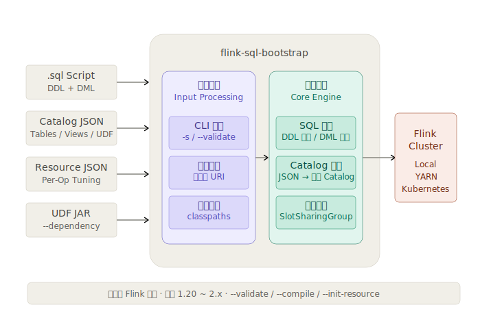

# 使用指南

## 快速开始

### 前置要求

| 依赖   | 版本   |
|:-------|:-------|
| Java   | 11+    |
| Flink  | 1.20+  |

> **准备工作**：本项目依赖 `flink-sql-gateway-*.jar`。运行前先将其从 `$FLINK_HOME/opt` 拷贝到 `$FLINK_HOME/lib`：
>
> ```bash
> cp $FLINK_HOME/opt/flink-sql-gateway-*.jar $FLINK_HOME/lib
> ```

### 下载

从 [GitHub Releases](https://github.com/tonyabasy/flink-sql-bootstrap/releases) 下载最新 JAR。

### 运行一个 SQL 脚本

最简单的方式 — 提交一个同时包含 DDL 和 DML 的 SQL 脚本：

```bash
$FLINK_HOME/bin/flink run \
    --target local \
    flink-sql-bootstrap-${version}.jar \
    --script-file classpath:example-word-count.sql
```

其中 `example-word-count.sql` 是一个自包含的 Word Count 示例：

```sql
CREATE TEMPORARY TABLE source_table (
  sentence STRING
) WITH (
  'connector' = 'datagen',
  'rows-per-second' = '1'
);

CREATE TEMPORARY TABLE sink_table (
  word STRING,
  cnt BIGINT
) WITH (
  'connector' = 'print'
);

INSERT INTO sink_table
SELECT word, COUNT(*) AS cnt
FROM source_table
CROSS JOIN UNNEST(SPLIT(sentence, ' ')) AS t(word)
GROUP BY word;
```

运行后，你将看到类似如下的输出（具体值因 datagen 随机生成而异）：

```
+I[<random_hex_string>, 1]
+I[<random_hex_string>, 1]
+I[<random_hex_string>, 1]
```


## 核心功能

### 多语句 SQL 脚本

在一个 `.sql` 文件中编写 DDL、DML、`SET`、`CALL` 等语句 —— 启动器自动拆解、校验并编排执行：

- **DDL 立即执行** —— 脚本切分过程中立刻执行 DDL，因为后续语句可能依赖 Catalog 状态。
- **DML 延迟处理** —— 批量解析、编译、翻译，以便在提交前向 DAG 中注入资源规格。
- 支持从 `classpath:`、`file://`、`http(s)://`、`hdfs://`、`s3://` 加载脚本。

### Catalog 快照

通过 JSON 快照预注册表、视图和 UDF，使 SQL 脚本中**无需 DDL**——只需纯粹的 DML：

```bash
$FLINK_HOME/bin/flink run \
    --target local \
    flink-sql-bootstrap-${version}.jar \
    --script-file classpath:example-word-count-advanced.sql \
    --catalog-file classpath:example-catalog.json \
    --resource-file classpath:example-resource.json \
    --dependency classpath:example-udf-reverse.jar \
    --dependency classpath:example-udf-substring.jar
```

表和 UDF 在作业启动时预注册，SQL 脚本变为干净的 DML：

```sql
INSERT INTO dws_word_count
SELECT my_reverse(my_substring(word, 0, 2)) AS word, COUNT(*) AS cnt
FROM ods_words
CROSS JOIN UNNEST(SPLIT(sentence, ' ')) AS t(word)
GROUP BY my_reverse(my_substring(word, 0, 2));
```

### 算子级资源调优

从 SQL 脚本生成资源模板：

```bash
$FLINK_HOME/bin/flink run ... --script-file job.sql --init-resource
```

输出包含每个算子 UID 的 JSON 模板。按算子调整 CPU、堆内存、托管内存、并行度和算子链策略后注入：

```bash
$FLINK_HOME/bin/flink run ... --script-file job.sql --resource-file resource.json
```

资源通过 **SlotSharingGroup** 注入，相同资源配置的算子自动归入同一 SlotSharingGroup，算子链得以保持。

> **注意**：当 SQL 脚本的 DAG 发生变化（如修改 `GROUP BY`、新增表、调整 JOIN 等），算子 UID 结构可能会改变，导致原有资源配置文件失效。此时需要通过 `--init-resource` 重新生成资源配置模板。


## 执行模式

除完整执行外，还提供三种干运行模式，适用于 CI/CD 和开发调试：

| 模式 | 参数 | 说明 |
|:-----|:-----|:-----|
| **正常执行** | *(默认)* | 完整流程：解析 → 编译 → 注入 → 提交 |
| **语法校验** | `--validate` | 解析并校验 SQL 语法，不提交到集群。错误信息精确到行号和列号。 |
| **编译** | `--compile` | 解析、校验并编译，输出 `InternalPlan` JSON 供检查。 |
| **生成资源模板** | `--init-resource` | 从 SQL 中提取 DAG 结构，输出资源配置模板。 |

```bash
# 校验 SQL
$FLINK_HOME/bin/flink run ... --script-file job.sql --validate

# 编译并查看执行计划
$FLINK_HOME/bin/flink run ... --script-file job.sql --compile

# 生成资源模板
$FLINK_HOME/bin/flink run ... --script-file job.sql --init-resource
```


## 配置参考

### CLI 参数

运行时通过 `-h` / `--help` 查看完整帮助。每种资源类型 `--xxx` 和 `--xxx-file` 互斥——前者接受直接值或本地路径，后者接受 URI（支持 `file://`、`http(s)://`、`hdfs://`、`s3://`）。

| 短参 | 长参 | 说明 |
|:-----|:-----|:-----|
| `-h` | `--help` | 打印帮助信息并退出。 |
| `-s` | `--script` | SQL 脚本内容，直接传字符串。 |
| `-sf` | `--script-file` | SQL 脚本文件 URI（与 `--script` 二选一必填）。 |
| `-c` | `--catalog` | Catalog 快照 JSON，直接传字符串。 |
| `-cf` | `--catalog-file` | Catalog 快照文件 URI。 |
| `-r` | `--resource` | 资源配置 JSON，直接传字符串。 |
| `-rf` | `--resource-file` | 资源配置文件 URI。 |
| `-d` | `--dependency` | UDF JAR 本地路径，可多次指定。 |
| | `--validate` | 解析并校验 SQL 语法，不提交作业。 |
| | `--compile` | 解析、校验并编译，输出执行计划 JSON。 |
| | `--init-resource` | 从当前 SQL 脚本生成资源配置模板，用于首次配置细粒度资源时生成初始化的配置脚本。 |

### 资源调优 JSON

描述每个算子的资源配置。每个算子通过 `uid`（优先）或 `name` 匹配。

> **使用限制**：
> - 必须对所有算子配置资源或全部不配置，不可以只对部分算子进行配置，否则会因细粒度资源配置匹配不上而导致任务启动失败。
> - 当 SQL 脚本导致 DAG 结构变化时，需重新通过 `--init-resource` 生成配置。

**内置 Profile 预设：**

| Profile | CPU | Heap | Managed | 适用场景 |
|:--------|:----|:-----|:--------|:---------|
| `stateless` | 0.5 | 512 MB | — | filter、map、简单转换 |
| `stateful` | 1.0 | 2 GB | 256 MB | 窗口、去重 |
| `join_heavy` | 1.0 | 4 GB | 512 MB | interval join、lookup join |
| `sink` | 0.5 | 1 GB | — | jdbc sink、file sink |

设置 `profile` 后，显式的 `cpu`/`heap`/`managed`/`offHeap` 值会被忽略。

```json
{
  "version": 1,
  "defaultParallelism": 2,
  "operators": [
    {
      "uid": "1_source",
      "name": "ods_words[1]",
      "parallelism": 1,
      "chainStrategy": "HEAD",
      "resource": { "profile": "stateless" }
    },
    {
      "uid": "5_group-aggregate",
      "name": "GroupAggregate[5]",
      "parallelism": 4,
      "chainStrategy": "ALWAYS",
      "resource": {
        "cpu": 1.0,
        "heap": "2048m",
        "managed": "256m"
      }
    }
  ]
}
```

| 字段 | 类型 | 说明 |
|:-----|:-----|:-----|
| `version` | int | 配置格式版本，当前为 `1`。 |
| `defaultParallelism` | int | 全局默认并行度，`0` 不覆盖。优先级：算子级 > 此值 > Flink 配置。 |
| `operators` | 数组 | 算子配置列表，必须覆盖全部 PhysicalTransformation。 |
| `operators[].uid` | string | 稳定 UID，用于精确匹配（优先）。 |
| `operators[].name` | string | 算子名称，用于兜底匹配。 |
| `operators[].parallelism` | int | 算子并行度，`-1` 走 defaultParallelism 或 Flink 默认。 |
| `operators[].chainStrategy` | string | `HEAD`、`ALWAYS`、`NEVER`，`null` 不做变更。 |
| `operators[].resource.profile` | string | 预置规格，设置后显式 CPU/内存值被忽略。取值见上方预设表。 |
| `operators[].resource.cpu` | double | CPU 核数，支持小数。仅在 profile 为空时生效。 |
| `operators[].resource.heap` | string | Task 堆内存，如 `"512 MB"`、`"2g"`。 |
| `operators[].resource.managed` | string | 托管内存，如 `"256m"`。 |
| `operators[].resource.offHeap` | string | 堆外内存，如 `"128m"`（可选）。 |
| `operators[].resource.external` | map | 外部资源，如 `{"gpu": 1.0}`（可选）。 |

### Catalog 快照 JSON

描述一个自包含的 Catalog，包含表、视图和 UDF。

```json
{
  "version": 1,
  "snapshotId": "example-word-count",
  "catalogName": "platform",
  "databaseName": "default",
  "tables": [
    {
      "database": "default",
      "name": "ods_words",
      "columns": [
        { "name": "sentence", "type": "STRING", "nullable": true },
        { "name": "ts", "type": "TIMESTAMP_LTZ(3)", "nullable": false,
          "isComputed": true, "computedExpr": "PROCTIME()" }
      ],
      "primaryKey": { "columnNames": ["id"], "enforced": true },
      "watermark": { "rowtimeColumn": "ts", "expression": "ts - INTERVAL '5' SECOND" },
      "partitionKeys": [],
      "options": {
        "connector": "datagen",
        "rows-per-second": "1"
      }
    }
  ],
  "views": [
    {
      "database": "default",
      "name": "v_latest_words",
      "expandedQuery": "SELECT sentence FROM ods_words WHERE ts > CURRENT_TIMESTAMP - INTERVAL '10' MINUTE"
    }
  ],
  "udfs": [
    {
      "database": "default",
      "name": "my_reverse",
      "kind": "SCALAR",
      "className": "examples.udf.MyReverseFunction",
      "functionLanguage": "JAVA",
      "jarRef": "example-udf-reverse.jar"
    }
  ]
}
```

> **注意**：UDF 的 `jarRef` 仅用于血缘统计，UDF JAR 的真实加载通过 `--dependency` 或 `pipeline.classpaths` 完成，不会根据此字段自动加载。

| 字段 | 类型 | 说明 |
|:-----|:-----|:-----|
| `version` | int | 格式版本，当前为 `1`。 |
| `snapshotId` | string | 快照唯一标识。 |
| `catalogName` | string | Flink Catalog 名称。 |
| `databaseName` | string | 默认数据库名。 |

**tables[].columns[] — 列定义：**

| 字段 | 类型 | 说明 |
|:-----|:-----|:-----|
| `name` | string | 列名。 |
| `type` | string | Flink SQL 类型字符串，如 `"BIGINT"`、`"TIMESTAMP_LTZ(3)"`。 |
| `nullable` | bool | 是否可为 null。 |
| `isComputed` | bool | 是否为计算列（如 `PROCTIME()`）。 |
| `computedExpr` | string | 计算列表达式，仅计算列时填写。 |
| `isMetadata` | bool | 是否为 metadata 列。 |
| `metadataKey` | string | metadata 列的 key，普通 metadata 列可为空。 |
| `virtual` | bool | metadata 列是否声明为 VIRTUAL。 |
| `comment` | string | 列注释（可选）。 |

**tables[] — 表定义：**

| 字段 | 类型 | 说明 |
|:-----|:-----|:-----|
| `database` | string | 所属数据库名。 |
| `name` | string | 表名。 |
| `columns` | 数组 | 列定义列表，见上方。 |
| `primaryKey` | object | 主键：`constraintName`(string)、`columnNames`(数组)、`enforced`(bool)。 |
| `watermark` | object | Watermark：`rowtimeColumn`(string)、`expression`(string)。 |
| `partitionKeys` | 数组 | 分区键列名列表。 |
| `comment` | string | 表注释（可选）。 |
| `options` | map | Connector 等配置项。 |

**views[] — 视图定义：**

| 字段 | 类型 | 说明 |
|:-----|:-----|:-----|
| `database` | string | 所属数据库名。 |
| `name` | string | 视图名。 |
| `expandedQuery` | string | 展开后的 SQL 查询语句。注意字段名是 `expandedQuery`。 |
| `comment` | string | 视图注释（可选）。 |

**udfs[] — UDF 定义：**

| 字段 | 类型 | 说明 |
|:-----|:-----|:-----|
| `database` | string | 所属数据库名，null 时回退到根级 `databaseName`。 |
| `name` | string | 函数名。 |
| `kind` | string | `SCALAR`、`TABLE` 或 `AGGREGATE`。 |
| `className` | string | 全限定类名。 |
| `functionLanguage` | string | `JAVA` 或 `PYTHON`。 |
| `jarRef` | string | JAR 文件名引用，**仅用于血缘统计，不用于加载**。 |
| `description` | string | 函数描述（可选）。 |
| `typeInference` | map | 类型推断提示（可选），null 表示 Flink 通过反射推断。 |


## 架构

Flink SQL Bootstrap 是 Flink 官方 API 之上的一个轻量级编排层。**不修改** Flink 引擎、Planner 或 SQL 语义。



上图展示了整体处理链路：外部输入（SQL 脚本、Catalog 快照、资源配置、UDF JAR）进入系统后分为**输入处理**（CLI 解析、文件读取、依赖合并）和**核心执行**（SQL 编排、Catalog 恢复、资源注入）两个阶段，最终通过 `executeInternal()` 提交到 Flink 集群。

### 关键设计考量

**依托 Flink SQL Gateway 模块，无需考虑语义兼容。** 本项目直接复用 `flink-sql-gateway-*.jar` 中的 `SessionContext`、`OperationExecutor` 和 `Planner`，确保了 `parse → validate → compile` 的标准流水线与 Flink 官方完全一致。所有 SQL 语义由 Flink 社区维护，项目本身不做任何方言扩展或语义修改。

**资源注入借助 DataStream 的细粒度资源机制。** 通过 `SlotSharingGroup` 注入每算子 CPU/内存/并行度，利用 Flink DataStream API 自身的 `Transformation.setSlotSharingGroup()` 能力，相同资源配置的算子自动归入同一 SlotSharingGroup，算子链得以保持。

**Catalog 使用快照而非实时连接，是刻意为之。** 一个 Flink 作业的启动和重启，不应该因为外部元数据变更而产生不可预测的行为。快照将表、视图、UDF 固化为一个 JSON 文件，保证每次启动作业的 Catalog 状态恒定，重启行为完全可预测。如需更新 Catalog，显式重新生成快照即可。

## 能力边界

**它是什么：**
- 一个生产级的 Flink SQL Application 模板
- 一座连接 Flink SQL 脚本与外部元数据、细粒度资源控制的桥梁

**它不是什么：**
- **不是** Flink SQL Gateway — 遵循 `flink run` 作业提交范式
- **不是** 工具类库 — 它是一个带 `main()` 方法的 Application，不是 `pom.xml` 加个 dependency

**边界承诺：**
- 零修改 Flink 引擎、Planner 或 SQL 语义
- 不提供自定义 SQL 方言，执行结果与原生 Flink SQL 完全一致
- 用户 Flink 配置原样透传

## 兼容性

通过[兼容性测试套件](https://tonyabasy.github.io/flink-sql-bootstrap/flink-compat-test-1.0.0.html)在 Local、YARN、Kubernetes 环境下全面验证。

| Flink 版本 | Local | YARN-App | YARN-Session | K8s-Session | K8s-App |
|:-----------|:-----:|:--------:|:------------:|:-----------:|:-------:|
| 1.20.4 | ✅ | ✅ | ✅ | ✅ | ✅ |
| 2.0.2 | ✅ | ✅ | ✅ | ✅ | ✅ |
| 2.1.1 | ✅ | ✅ | ✅ | ✅ | ✅ |
| 2.2.0 | ✅ | ✅ | ✅ | ✅ | ✅ |

✅ 通过 · ❌ 失败 · — 尚未测试
